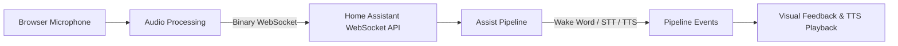
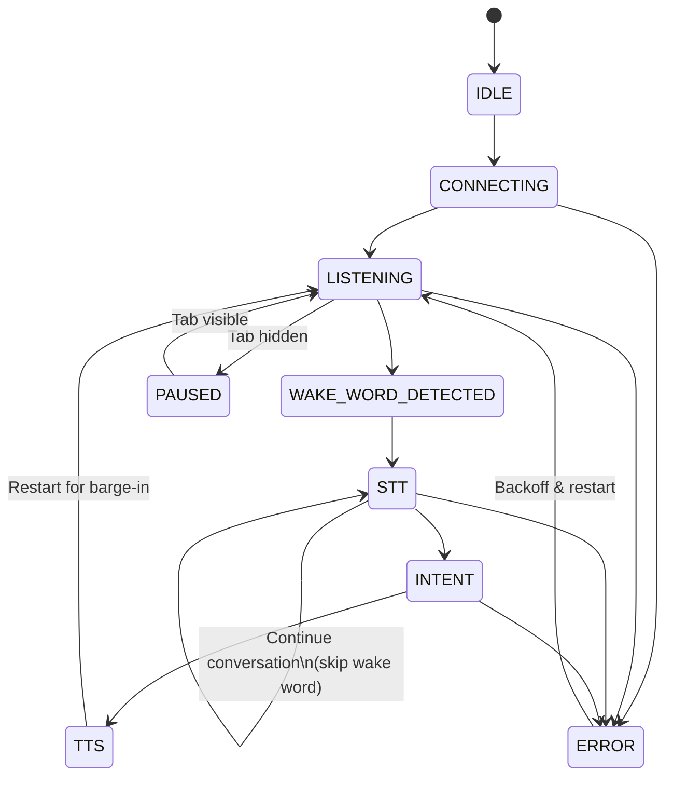

# Voice Satellite Card — Design Document

## 1. Overview

Voice Satellite Card is a custom Home Assistant Lovelace card that turns any browser into a voice-activated satellite. It captures microphone audio, sends it to Home Assistant's Assist pipeline over WebSocket, and plays back TTS responses — all without leaving the HA dashboard.

The source is organized as ES6 modules in `src/`, bundled via Webpack + Babel into a single `voice-satellite-card.min.js` for deployment. The card is invisible (returns `getCardSize() = 0`). All visual feedback is rendered via a global overlay appended to `document.body`, outside HA's Shadow DOM, so it persists across dashboard view changes.

---

## 2. High-Level Flow



1. The card acquires the browser microphone via `getUserMedia`.
2. Audio is captured via AudioWorklet (or ScriptProcessor fallback), resampled to 16 kHz mono PCM, and sent as binary WebSocket frames every 100 ms.
3. Home Assistant's `assist_pipeline/run` subscription routes the audio through wake word detection → speech-to-text → intent processing → text-to-speech.
4. The card receives pipeline events, updates visual feedback (gradient bar, transcription/response bubbles), and plays the TTS audio via an `<audio>` element.
5. When TTS begins playing, the pipeline is immediately restarted so it listens for the next wake word while audio plays (barge-in support). If the conversation agent signals `continue_conversation`, the card skips the wake word stage and restarts in STT mode for multi-turn dialogues.
6. The cycle repeats indefinitely.

---

## 3. Architecture

### 3.1 Project Structure

```
voice-satellite-card/
├── src/                              ← ES6 source modules
│   ├── index.js                      ← Entry point, custom element registration
│   ├── card.js                       ← VoiceSatelliteCard (thin orchestrator)
│   ├── constants.js                  ← State enum, DEFAULT_CONFIG (incl. state_entity), VERSION
│   ├── logger.js                     ← Shared Logger class
│   ├── audio.js                      ← AudioManager (mic, worklet, resample, send)
│   ├── tts.js                        ← TtsManager (playback, chimes, streaming TTS)
│   ├── pipeline.js                   ← PipelineManager (start/stop/restart, events, recovery)
│   ├── ui.js                         ← UIManager (overlay, bar, blur, start button)
│   ├── chat.js                       ← ChatManager (bubbles, streaming fade)
│   ├── styles.css                    ← CSS styles (imported as raw string via webpack)
│   ├── double-tap.js                 ← DoubleTapHandler (cancel with touch dedup)
│   ├── visibility.js                 ← VisibilityManager (tab pause/resume)
│   └── editor.js                     ← VoiceSatelliteCardEditor (visual config)
├── voice-satellite-card.min.js       ← Built output (minified, committed)
├── voice-satellite-card.js           ← Built output (readable, gitignored)
├── voice-satellite-card.js.map       ← Source map (gitignored)
├── package.json                      ← npm scripts: build, release
├── webpack.config.js                 ← Dual output (readable + minified)
├── babel.config.js                   ← ES6+ target (modern browsers)
└── .vscode/
    ├── settings.json                 ← Editor config
    └── tasks.json                    ← Ctrl+Shift+B → npm run build
```

### 3.2 Build System

Webpack bundles all ES6 modules into a single file for HA custom card deployment. Babel transpiles only features unsupported by the last 2 versions of Chrome, Firefox, Safari, and Edge — native ES6+ (classes, arrow functions, async/await, const/let) passes through untranspiled for performance. CSS files are imported as raw strings via Webpack's `asset/source` type (no CSS extraction — the string is injected into the DOM at runtime by `UIManager`).

The version number is defined once in `package.json` and injected at build time via Webpack's `DefinePlugin` as `__VERSION__`, consumed by `constants.js`.

**npm scripts:**

- `npm run build` — produces both `voice-satellite-card.js` (readable, with source map) and `voice-satellite-card.min.js` (minified, no source map) in the repo root
- `npm run dev` — builds and copies the readable version + source map to HA (`\\hassio\config\www\`)

Only `voice-satellite-card.min.js` is committed to git. The readable version and source map are gitignored (local debugging only).

**VS Code integration:** `.vscode/tasks.json` maps **Ctrl+Shift+B** to `npm run dev` (default build task).

### 3.3 Composition Pattern

The main `VoiceSatelliteCard` class is a thin orchestrator. All functionality is delegated to manager instances created in the constructor:

| Manager | Property | Responsibility |
|---------|----------|---------------|
| `Logger` | `card.logger` | Debug-gated console logging |
| `AudioManager` | `card.audio` | Mic capture, AudioWorklet/ScriptProcessor, resample, binary send |
| `TtsManager` | `card.tts` | Browser/remote TTS playback, chimes, streaming TTS |
| `PipelineManager` | `card.pipeline` | Pipeline lifecycle, event handling, idle timeout, error recovery |
| `UIManager` | `card.ui` | Global overlay, rainbow bar, blur, start button |
| `ChatManager` | `card.chat` | Chat bubbles, streaming fade, legacy wrappers |
| `DoubleTapHandler` | `card.doubleTap` | Double-tap cancel with touch/click dedup |
| `VisibilityManager` | `card.visibility` | Tab visibility pause/resume |

Each manager receives the card instance via its constructor and accesses other managers through `this._card.tts`, `this._card.audio`, etc. The card exposes public getters (`config`, `connection`, `hass`, `currentState`) that managers read as needed.

**Callback pattern:** Managers that need to notify the card use explicit callback methods rather than events:

- `TtsManager` → `card.onTTSComplete()` — playback finished, clean up UI or continue conversation
- `DoubleTapHandler` → `card.setState()`, `card.pipeline.restart()`, `card.updateInteractionState('IDLE')` — cancel interaction
- `VisibilityManager` → `card.setState()`, `card.pipeline.restart()` — resume after tab switch

The `connection` getter includes a fallback: if `this._connection` is null (e.g. after a tab switch where the `hass` setter hasn't re-fired), it re-grabs the connection from `this._hass.connection` automatically.

### 3.4 Card Lifecycle

**Registration (`index.js`):**

```javascript
customElements.define('voice-satellite-card', VoiceSatelliteCard);
customElements.define('voice-satellite-card-editor', VoiceSatelliteCardEditor);
window.customCards = window.customCards || [];
window.customCards.push({ type: 'voice-satellite-card', name: 'Voice Satellite Card', ... });
console.info('%c VOICE-SATELLITE-CARD %c v' + VERSION + ' ', ...);  // styled banner
```

**Constructor:** Creates all manager instances. Initial state is `IDLE`. The card renders a hidden Shadow DOM element (`<div id="voice-satellite-card" style="display:none;">`).

**`set hass(hass)`:** Called by HA when connection is available. First call only (guarded by `_hasStarted`):
- Stores `this._connection = hass.connection`
- Calls `ui.ensureGlobalUI()` to create global overlay
- If `start_listening_on_load` is true → `_startListening()`
- Otherwise → `ui.showStartButton()`

**`setConfig(config)`:** Merges user config with `DEFAULT_CONFIG`. Updates logger debug flag. Calls `ui.applyStyles()` if overlay exists. If a different card instance is active (`window._voiceSatelliteInstance`), propagates config to it.

**`connectedCallback()`:** Renders Shadow DOM, ensures global UI, sets up visibility handler. If no instance is active and hass is available, starts listening.

**`disconnectedCallback()`:** Uses 100ms delay to distinguish view switches from real disconnects.

**`_startListening()` sequence:**
1. Guards against concurrent starts (`window._voiceSatelliteStarting`)
2. Sets state to CONNECTING
3. `await audio.startMicrophone()`
4. `await pipeline.start()`
5. Sets `window._voiceSatelliteActive = true`, `window._voiceSatelliteInstance = this`
6. Hides start button, sets up double-tap handler
7. On failure: shows start button with reason (`not-allowed`, `not-found`, `not-readable`, or `error`)

**`_handleStartClick()`:** Called from start button click. First calls `audio.ensureAudioContextForGesture()` (creates/resumes AudioContext within the user gesture), then `_startListening()`.

### 3.5 Event Routing

`card._handlePipelineMessage(message)` is the central event dispatcher. It first checks guards (`visibility.isPaused`, `pipeline.isRestarting`), then routes by `message.type`:

| Event | Handler |
|-------|---------|
| `run-start` | `pipeline.handleRunStart(eventData)` |
| `wake_word-start` | `pipeline.handleWakeWordStart()` |
| `wake_word-end` | `pipeline.handleWakeWordEnd(eventData)` |
| `stt-start` | `card.setState(State.STT)` |
| `stt-vad-start` | Log only |
| `stt-vad-end` | Log only |
| `stt-end` | `pipeline.handleSttEnd(eventData)` |
| `intent-start` | `card.setState(State.INTENT)` |
| `intent-progress` | `pipeline.handleIntentProgress(eventData)` (only if `streaming_response` config enabled) |
| `intent-end` | `pipeline.handleIntentEnd(eventData)` |
| `tts-start` | `card.setState(State.TTS)` |
| `tts-end` | `pipeline.handleTtsEnd(eventData)` |
| `run-end` | `pipeline.handleRunEnd()` |
| `error` | `pipeline.handleError(errorData)` |

Debug logging includes timestamp (extracted from `message.timestamp`) and truncated JSON of event data (500 chars max).

### 3.6 TTS Complete Callback

`card.onTTSComplete()` handles the end of TTS playback (called by `TtsManager._onComplete()`):

1. **Barge-in check:** If current state is an active interaction (WAKE_WORD_DETECTED, STT, INTENT, TTS), a new interaction has started — skip cleanup entirely.
2. **Continue conversation:** If `pipeline.shouldContinue` and `pipeline.continueConversationId` are set, keep blur/bar/chat visible, clear `chat.streamEl` (so next turn creates fresh bubble), call `pipeline.restartContinue(conversationId)`.
3. **Normal completion:** Play done chime (browser only, not remote TTS), call `chat.clear()`, `ui.hideBlurOverlay()`, `ui.updateForState()`.

### 3.7 Response Text Extraction

`pipeline._extractResponseText(eventData)` uses a 4-level fallback chain to handle different HA response formats:

1. `eventData.intent_output.response.speech.plain.speech` (standard format)
2. `eventData.intent_output.response.speech.speech` (alternative)
3. `eventData.intent_output.response.plain` (simplified)
4. `eventData.intent_output.response` if it's a raw string

Returns `null` if none found.

### 3.8 Deferred Run-End

When `run-end` arrives while TTS is still playing, the pipeline sets `_pendingRunEnd = true` and defers cleanup. `finishPendingRunEnd()` is available but currently the run-end is naturally resolved when TTS completes and `onTTSComplete()` handles cleanup. The `_finishRunEnd()` method clears `_pendingRunEnd`, calls `chat.clear()`, `ui.hideBlurOverlay()`, sets state to IDLE, and restarts the pipeline.

### 3.9 UI Pending Start Button

`UIManager` has a `_pendingStartButtonReason` field. If `showStartButton()` is called before the global UI overlay exists (possible during early `hass` setter), the reason is stored. `_flushPendingStartButton()` is called by `ensureGlobalUI()` to show the button once the overlay is created. The start button is shown by default (with `.visible` class) when the global UI is first created.

---

## 4. State Machine



| State | Description |
|-------|-------------|
| `IDLE` | Not connected, waiting to start |
| `CONNECTING` | Acquiring microphone, subscribing to pipeline |
| `LISTENING` | Pipeline active, listening for wake word. No visible bar. |
| `PAUSED` | Tab hidden, microphone tracks disabled, audio send stopped |
| `WAKE_WORD_DETECTED` | Wake word heard. Bar visible with "listening" animation. Blur overlay shown. |
| `STT` | Speech-to-text in progress. Bar continues "listening" animation. |
| `INTENT` | Processing user intent. Bar switches to "processing" (fast) animation. |
| `TTS` | TTS URL received, audio playing. Bar shows "speaking" animation. |
| `ERROR` | Unexpected error occurred. Red error bar visible. Retry with backoff. |

State transitions are driven exclusively by pipeline events from Home Assistant. `card.setState(newState)` logs the transition and calls `ui.updateForState()` to update the gradient bar.

---

## 5. User Interface

### 5.1 Global UI Overlay

All UI elements are inside a single `<div id="voice-satellite-ui">` appended to `document.body`. This is required because Home Assistant destroys and recreates custom card elements when switching dashboard views, but the microphone, WebSocket, and visual feedback must persist.

```html
<div id="voice-satellite-ui">
  <div class="vs-blur-overlay"></div>
  <button class="vs-start-btn"><svg>...</svg></button>
  <div class="vs-chat-container"></div>
  <div class="vs-rainbow-bar"></div>
</div>
```

Only one instance of this overlay ever exists (singleton pattern). The active card instance is tracked via `window._voiceSatelliteInstance`.

CSS styles are injected once into `<head>` as a `<style id="voice-satellite-styles">` element. All selectors are prefixed with `#voice-satellite-ui` to avoid conflicts.

**Z-index layers:**

| Element | z-index | Notes |
|---------|---------|-------|
| `.vs-blur-overlay` | 9999 | Behind everything else |
| `.vs-rainbow-bar` | 10000 | Above blur |
| `.vs-start-btn` | 10001 | Above bar |
| `.vs-chat-container` | 10001 | Same as button (never shown simultaneously) |

**Start button SVG:** A 24×24 viewBox microphone icon path: `M12 14c1.66 0 3-1.34 3-3V5c0-1.66-1.34-3-3-3S9 3.34 9 5v6c0 1.66 1.34 3 3 3zm5.91-3c-.49 0-.9.36-.98.85C16.52 14.2 14.47 16 12 16s-4.52-1.8-4.93-4.15c-.08-.49-.49-.85-.98-.85-.61 0-1.09.54-1 1.14.49 3 2.89 5.35 5.91 5.78V20c0 .55.45 1 1 1s1-.45 1-1v-2.08c3.02-.43 5.42-2.78 5.91-5.78.1-.6-.39-1.14-1-1.14z`

### 5.2 Pointer Events — Critical

All overlay elements use `opacity: 0` when hidden but remain in the DOM as fixed-position elements with high `z-index`. Without `pointer-events: none`, these invisible elements block all mouse and touch events on the entire HA dashboard. Every hidden overlay element MUST have `pointer-events: none`, switching to `pointer-events: auto` only when the `.visible` class is added.

### 5.3 Blur Overlay

A full-screen semi-transparent backdrop with `backdrop-filter: blur()`. Shown when wake word is detected, hidden when TTS completes or an error occurs. Always has `pointer-events: none` so the user can still interact with the dashboard behind it.

### 5.4 Chat Container

All conversation messages (user transcriptions and assistant responses) are displayed in a unified chat container (`.vs-chat-container`), managed by `ChatManager` (`card.chat`). This replaces the previous separate transcription/response bubble system with a single code path that works for both single-turn and multi-turn conversations.

The container is a flex column positioned at the bottom of the screen above the gradient bar, centered horizontally. Messages are appended as child `<div class="vs-chat-msg">` elements with either a `.user` or `.assistant` class. Each message is styled according to the transcription or response bubble configuration (font, color, background, border, padding, rounding). Messages fade in with a CSS animation (`vs-chat-fade-in`).

**Key methods (ChatManager):**

- `addUser(text)` — appends a user message (styled with transcription config)
- `addAssistant(text)` — appends an assistant message (styled with response config), stores element as `streamEl`
- `updateResponse(text)` — creates or updates assistant bubble with trailing text fade effect (see below)
- `clear()` — removes all messages, hides container, resets `streamEl` and `streamedResponse`

**Legacy API wrappers** route calls to the core methods:

- `showTranscription(text)` → `addUser(text)` (respects `show_transcription` config)
- `showResponse(text)` → sets final text via `textContent` (no fade) if `streamEl` exists, or `addAssistant(text)` for new bubble (respects `show_response` config)
- `hideTranscription()` → no-op (messages persist until `clear()`)
- `hideResponse()` → no-op (messages persist until `clear()`)

**Streaming text fade:** During streaming, `chat.updateResponse()` applies a trailing character fade to give the appearance of text flowing in smoothly. The last 24 characters (`FADE_LEN`) are each wrapped in a `<span>` with decreasing opacity — the character right after the solid text is at full opacity, and the very last character fades to near-transparent. As new chunks arrive and the text grows, the fade window slides forward. When `pipeline.handleIntentEnd()` fires with the final complete text, `chat.showResponse()` sets `textContent` directly (no spans, no fade), making all text crisp and clean. For short texts (≤ `FADE_LEN` characters), no fade is applied.

**Intent-end cleanup:** `pipeline.handleIntentEnd()` always resets `chat.streamedResponse = ''` and `chat.streamEl = null` after processing. This prevents stale streaming state from leaking into the next interaction or continue-conversation turn.

**Chat container positioning:** `ui.applyStyles()` positions the chat container above the gradient bar with a 12px gap. When `bar_position` is `'bottom'`, the container's CSS `bottom` is set to `barHeight + 12` pixels. When `bar_position` is `'top'`, the container sits at `bottom: 12px` (bar is at top, so no offset needed). The container always uses `bottom` positioning (never `top`) and content grows upward.

**Message styling:** Each message `<div class="vs-chat-msg">` gets inline styles from config: `fontSize`, `fontFamily`, `color`, `fontWeight` (bold → `'bold'`), `fontStyle` (italic → `'italic'`), `background`, `border` (3px solid + border color), `padding`, `borderRadius` (rounded → `'12px'`, else `'0'`). User messages use `transcription_*` config keys, assistant messages use `response_*` keys. Messages have a fade-in animation (`vs-chat-fade-in`: opacity 0→1, translateY 8px→0 over 0.3s) and a box shadow (`0 4px 12px rgba(0,0,0,0.15)`).

**Single-turn behavior:** One user message + one assistant message appear during the interaction, then `chat.clear()` removes everything when the conversation ends.

**Multi-turn behavior (continue conversation):** Messages accumulate in the container across turns, creating a chat-style thread. The container is only cleared when the conversation fully ends (done chime) or is interrupted (barge-in, tab switch, error).

The container uses `display: none` by default and switches to `display: flex` when the `.visible` class is added. This ensures no stale content can flash on screen between interactions. The container has `overflow: visible` and no scrollbar — messages simply grow upward from the bottom. All messages are centered horizontally within the container.

### 5.5 Start Button

A floating circular microphone button (56×56px, bottom-right corner) with a pulsing animation. Shown when automatic microphone access fails (browser user gesture required, mic permission denied, no mic found). Hidden once the microphone starts successfully. The click handler is the critical user gesture entry point (see Section 12: Browser Microphone Restrictions).

---

## 6. Gradient Bar

An animated gradient bar fixed to the bottom (or top) of the screen. The bar's gradient colors, height, and position are all configurable.

### 6.1 Bar States

| State | Visible | Animation | Speed |
|-------|---------|-----------|-------|
| IDLE, CONNECTING, LISTENING, PAUSED | No | — | — |
| WAKE_WORD_DETECTED, STT | Yes | `vs-gradient-flow` | 3s (slow flow) |
| INTENT | Yes | `vs-gradient-flow` | 0.5s (fast flow) |
| TTS | Yes | `vs-gradient-flow` | 2s (medium flow) |
| ERROR | Yes | `vs-gradient-flow` | 2s, with red gradient |

### 6.2 Error Mode

When an unexpected error occurs, the bar switches to a red gradient (`#ff4444, #ff6666, #cc2222`) and stays visible via the `pipeline.serviceUnavailable` flag. The `ui.updateForState()` method checks this flag and refuses to hide the bar while it's set. The flag is cleared on successful pipeline recovery (`run-start` received, or wake word service recovers).

For intent-specific errors (LLM service down), a separate `pipeline._intentErrorBarTimeout` auto-hides the red bar after 3 seconds. This timeout is cancelled if a new wake word is detected.

### 6.3 TTS Bar Persistence

When TTS starts playing, the pipeline is immediately restarted for barge-in. This causes the state to transition to LISTENING, which normally hides the bar. The `ui.updateForState(state, serviceUnavailable, ttsPlaying)` method receives `ttsPlaying` as a parameter: if true, it refuses to hide the bar regardless of state. `card.onTTSComplete()` calls `ui.updateForState()` with `ttsPlaying: false`, allowing the bar to hide normally.

### 6.4 CSS Animations

```css
@keyframes vs-gradient-flow {
  0% { background-position: 0% 50%; }
  100% { background-position: 200% 50%; }
}
```

The `background-size` is set to `200% 100%` so the gradient scrolls continuously. Different animation durations create the effect of faster/slower movement for different states.

A breathing animation (`vs-bar-breathe`) exists in the CSS for a potential CONNECTING state indicator but is currently unused because it looked bad alongside the start button.

---

## 7. Chimes

All chimes are generated programmatically using the Web Audio API oscillator. No audio files are used.

### 7.1 Chime Types

| Chime | Trigger | Waveform | Frequencies | Duration |
|-------|---------|----------|-------------|----------|
| Wake | `wake_word-end` (valid wake word) | Sine | C5→E5→G5 (523→659→784 Hz) at 0/80/160ms | 250ms |
| Done | TTS playback complete (not interrupted) | Sine | G5→E5 (784→659 Hz) at 0/80ms | 250ms |
| Error | Unexpected pipeline error or intent error | Square | 300→200 Hz at 0/80ms | 150ms |

### 7.2 Volume

Volume is scaled to a maximum of 0.5 to avoid clipping: `(config.chime_volume / 100) * 0.5`. The error chime is additionally reduced to 30% of that value for a subtler sound.

### 7.3 Timing

The wake chime plays immediately on `wake_word-end`. The done chime plays in `card.onTTSComplete()` — NOT on `intent-end` — because playing it on `intent-end` would fire mid-interaction before TTS even starts. The done chime is also suppressed during barge-in (if the user said a new wake word while TTS was playing, the current state would be WAKE_WORD_DETECTED/STT/INTENT, not IDLE/LISTENING).

The error chime only plays if the user was actively interacting (state was WAKE_WORD_DETECTED, STT, INTENT, or TTS). Background pipeline errors during idle listening do not chime.

### 7.4 Configuration

`chime_on_wake_word: true` enables the wake chime. `chime_on_request_sent: true` enables the done chime. The error chime respects the `chime_on_wake_word` setting. Both can be independently disabled.

### 7.5 Implementation

Each chime creates a new `AudioContext`, plays the oscillator, then closes the context after 500ms via `setTimeout`. This avoids issues with suspended AudioContexts on mobile browsers.

---

## 8. Error Handling

### 8.1 Expected Errors

These are normal operational events. They trigger immediate pipeline restart with zero delay, no error chime, no red bar:

| Code | Meaning |
|------|---------|
| `timeout` | Pipeline-level idle timeout (from HA server) |
| `wake-word-timeout` | Wake word detection timed out |
| `stt-no-text-recognized` | User spoke but no text was recognized |
| `duplicate_wake_up_detected` | Wake word already being processed (note: underscores, not dashes — HA API inconsistency) |

**Interaction-aware cleanup:** Some expected errors (notably `stt-no-text-recognized`) occur after the wake word was detected, meaning the blur overlay and transcription bubble are still visible. Before restarting, the handler checks whether the current state is an active interaction state (WAKE_WORD_DETECTED, STT, INTENT, TTS). If so, it transitions to IDLE (via `card.setState()`, which also updates the gradient bar), hides the blur overlay, transcription, and response bubbles, and plays the done chime. For background expected errors like `timeout` or `wake-word-timeout`, the state is LISTENING so no cleanup runs.

### 8.2 Unexpected Errors

All other error codes (`stt-stream-failed`, `wake-stream-failed`, `intent-failed`, `tts-failed`, etc.) trigger full error handling:

1. Set `pipeline.serviceUnavailable` to true (keeps red bar visible)
2. Play error chime (if user was interacting)
3. Show red error bar
4. Hide blur overlay
5. Calculate retry delay and restart pipeline

### 8.3 Intent Errors

When the LLM service is down, `intent-end` still fires but with `response_type: "error"` inside `intent_output.response`. The card detects this, shows a red error bar (auto-hides after 3 seconds), plays the error chime, and sets `pipeline._suppressTTS` to true so the TTS of the error message ("Error talking to API") is skipped. The pipeline still restarts normally.

### 8.4 Wake Word Service Unavailable

When the wake word service itself is down, HA sends `wake_word-end` with an empty `wake_word_output` object (no `wake_word_id`). The card detects this via `Object.keys(wakeOutput).length === 0`, shows the error bar, and restarts with backoff.

Recovery detection uses a 2-second timer set on `wake_word-start`. If `wake_word-end` with empty output arrives within 2 seconds, the service is still down. If 2 seconds pass without the empty-output event, the service has recovered — `pipeline.serviceUnavailable` is cleared and `pipeline._retryCount` is reset.

---

## 9. Service Recovery & Retry Timeouts

### 9.1 Retry Backoff

Unexpected errors use linear backoff:

```javascript
delay = Math.min(5000 * retryCount, 30000);
// Attempt 1: 5s, Attempt 2: 10s, Attempt 3: 15s, ... Attempt 6+: 30s (cap)
```

The `pipeline._retryCount` is incremented on each retry and reset to 0 on successful recovery (when `run-start` event is received or a valid wake word fires).

### 9.2 Pipeline Idle Timeout (TTS Token Refresh)

TTS tokens expire after some time. The `pipeline_idle_timeout` (default 300 seconds) is a client-side timer that restarts the pipeline while it's sitting in LISTENING state to obtain fresh tokens. This is invisible to the user — no UI change, no chime.

The timeout resets on any pipeline activity (`run-start`, `wake_word-end`).

**Interaction guard:** When the idle timeout fires, it checks whether the user is mid-interaction (state is WAKE_WORD_DETECTED, STT, INTENT, or TTS) or TTS audio is still playing. If so, it defers by resetting itself rather than killing the active interaction. This prevents the timeout from interrupting a conversation if someone sets a short `pipeline_idle_timeout` combined with a slow LLM response.

### 9.3 Pipeline Response Timeout (Server-Side)

The `pipeline_timeout` value (default 60 seconds) is sent to Home Assistant in the `timeout` field of the pipeline run config. This is a per-run timeout — if a single pipeline run (wake word through TTS) exceeds this duration, HA sends an error event. In continue conversation mode, each turn is a separate pipeline run with its own timeout. Note: this is distinct from `pipeline_idle_timeout` which is a client-side timer (see §9.2).

### 9.4 Tab Visibility & Pause/Resume

When the tab is hidden, `visibility.isPaused` is set **immediately** (before the debounce) to block all incoming pipeline events in `card._handlePipelineMessage()`. If the user is mid-interaction (WAKE_WORD_DETECTED, STT, INTENT, TTS), all UI is cleaned up immediately: chat container cleared, blur overlay hidden, TTS stopped, continue conversation state reset. After a 500ms debounce, `audio.pause()` disables audio tracks and sets state to PAUSED.

When the tab becomes visible again, `visibility._resume()` resets all in-flight state (`pipeline.isRestarting`, `pipeline._continueMode`, pending `pipeline._restartTimeout`) and always calls `pipeline.restart(0)` to start fresh in wake word mode. This is necessary because while paused, the server-side pipeline likely completed or errored — the `run-end` event was dropped by the `visibility.isPaused` guard — so the old subscription is stale.

### 9.5 Intent Error Bar Timeout

Intent errors show a red bar that auto-hides after 3 seconds via `pipeline._intentErrorBarTimeout`. This timeout is cancelled if a new wake word is detected (so the bar doesn't suddenly disappear mid-interaction).

### 9.6 Concurrent Restart Prevention — Critical

When the pipeline idle timeout fires, HA responds with both a `run-end` event and an `error` event (code `timeout`) in rapid succession. Without protection, three separate calls to `pipeline.restart()` occur simultaneously within the same event loop tick:

1. The idle timeout callback fires → `pipeline.restart(0)`
2. The `run-end` event arrives → `pipeline.handleRunEnd()` → `pipeline._finishRunEnd()` → `pipeline.restart(0)`
3. The `error` event arrives → `pipeline.handleError()` → `pipeline.restart(0)`

Since `pipeline.stop()` is async (it awaits `pipeline._unsubscribe()`), the second and third calls see `pipeline._unsubscribe` as already null, resolve instantly, and each schedule their own `pipeline.start()`. This results in 3 parallel pipeline subscriptions with different `stt_binary_handler_id` values, all consuming server resources and causing unpredictable behavior.

The fix uses an `pipeline.isRestarting` flag:

```javascript
// PipelineManager.restart(delay)
restart(delay) {
  if (this._isRestarting) {
    this._log.log('pipeline', 'Restart already in progress — skipping');
    return;
  }
  this._isRestarting = true;
  this._clearIdleTimeout();  // Prevent idle timeout from firing during restart

  this.stop().then(function() {
    self._restartTimeout = setTimeout(function() {
      self._isRestarting = false;  // Clear flag right before starting new pipeline
      self.start().catch(...);
    }, delay || 0);
  });
}
```

The flag is set at entry, cleared just before `pipeline.start()` executes. Additionally, `pipeline.handleRunEnd()` checks `pipeline.isRestarting` early and skips entirely if a restart is already in flight.

---

## 10. WebSocket Communication

### 10.1 Connection

The card uses Home Assistant's existing WebSocket connection, available via `hass.connection`. It does not create its own WebSocket. The raw socket for binary audio is at `hass.connection.socket`.

### 10.2 Pipeline Subscription

```javascript
// PipelineManager.start()
this._unsubscribe = await connection.subscribeMessage(
  function(message) { self._card.onPipelineMessage(message); },
  {
    type: 'assist_pipeline/run',
    start_stage: 'wake_word',  // or 'stt' for continue conversation
    end_stage: 'tts',
    input: { sample_rate: 16000, timeout: 0 },
    pipeline: pipelineId,
    timeout: config.pipeline_timeout,
    // conversation_id: '...'  // included for continue conversation
  }
);
```

**`input.timeout: 0` is critical.** If omitted, HA defaults to 3 seconds, causing `wake-word-timeout` errors every 3 seconds. Setting it to 0 means "listen indefinitely for the wake word." The `timeout` field is omitted when `start_stage` is `'stt'` (continue conversation) so the server VAD handles silence detection.

`pipeline.start()` accepts an optional `options` parameter with `start_stage` and `conversation_id` for continue conversation mode. When not provided, defaults to `start_stage: 'wake_word'`.

The `timeout` at the top level is the overall pipeline response timeout sent to HA.

### 10.3 Pipeline Event Format

**HA's `subscribeMessage` for `assist_pipeline/run` delivers events DIRECTLY — NOT wrapped in `{ type: "event", event: {...} }`.**

```javascript
// What HA actually delivers to the callback:
{ type: "run-start", data: { runner_data: { stt_binary_handler_id: 1 } }, timestamp: "..." }
{ type: "wake_word-end", data: { wake_word_output: { wake_word_id: "ok_nabu" } }, timestamp: "..." }
{ type: "stt-end", data: { stt_output: { text: "turn on the lights" } }, timestamp: "..." }
```

The handler reads `message.type` and `message.data` directly. Do NOT check `message.type === 'event'` or access `message.event` — this will cause all events to be silently dropped.

**Event guards:** `card._handlePipelineMessage()` drops all events in two cases:

- `visibility.isPaused` is true — tab is hidden, UI has been cleaned up (see §9.4)
- `pipeline.isRestarting` is true — pipeline is being torn down and restarted (e.g. after double-tap cancel or barge-in). Without this guard, straggling events from the old subscription (like `intent-progress` chunks still in the WebSocket buffer) can recreate UI elements after `chat.clear()` has already cleaned up.

### 10.4 Pipeline Events Reference

| Event | Description | Key Data Fields |
|-------|-------------|-----------------|
| `run-start` | Pipeline initialized, ready for audio | `data.runner_data.stt_binary_handler_id` — required for binary audio framing. If streaming TTS is available: `data.tts_output.url` (pre-allocated TTS URL) and `data.tts_output.stream_response: true`. |
| `wake_word-start` | Listening for wake word | Used for recovery detection timing |
| `wake_word-end` | Wake word detected (or service unavailable if output empty) | `data.wake_word_output.wake_word_id` |
| `stt-start` | Speech-to-text engine started | State → STT |
| `stt-vad-start` | Voice activity detected (user speaking) | Logged, not acted upon |
| `stt-vad-end` | Voice activity ended (user stopped) | Logged, not acted upon |
| `stt-end` | Transcription complete | `data.stt_output.text` |
| `intent-start` | Intent processing started | State → INTENT |
| `intent-progress` | Streaming response token (when `streaming_response: true`) | `data.chat_log_delta.content` (string, append to accumulator). First chunk may be `{ role: "assistant" }` with no content — skip it. May also contain `data.tts_start_streaming: true` — signals TTS engine has started generating audio from partial text; trigger early TTS playback (see §15.3). |
| `intent-end` | Intent processing complete | `data.intent_output.response.speech.plain.speech` — the response text. Also check `data.intent_output.response.response_type` — if `"error"`, the LLM service is down. `data.intent_output.continue_conversation` (boolean) — if `true`, the agent expects a follow-up. `data.intent_output.conversation_id` (string) — pass to next pipeline run for conversation context. |
| `tts-start` | TTS generation started | State → TTS |
| `tts-end` | TTS audio URL ready | `data.tts_output.url` or `data.tts_output.url_path` — relative path, must be prefixed with `window.location.origin` |
| `run-end` | Pipeline run complete | Cleanup and restart |
| `error` | Error occurred | `data.code` (string), `data.message` (string) |

### 10.5 Binary Audio Transmission

Audio is sent as raw binary WebSocket frames. The first byte is the `stt_binary_handler_id` from `run-start`, followed by the 16-bit PCM audio data:

```javascript
var message = new Uint8Array(1 + pcmData.byteLength);
message[0] = this._binaryHandlerId;
message.set(new Uint8Array(pcmData.buffer), 1);
this._connection.socket.send(message.buffer);
```

Before sending, the code checks `socket.readyState === WebSocket.OPEN` to avoid errors during connection teardown.

### 10.6 Unsubscription & Restart Serialization

When the pipeline restarts, `pipeline.restart()` awaits `pipeline.stop()` which properly `await`s the unsubscribe function before the new subscription is created. This prevents stale subscriptions from piling up. All restart paths go through `pipeline.restart()` — no manual fire-and-forget unsubscribe calls.

A `pipeline.isRestarting` flag serializes concurrent restart attempts. This is critical because the pipeline idle timeout, `run-end`, and `error` events can all fire within the same event loop tick, each trying to restart the pipeline. Without the flag, multiple parallel subscriptions are created (see Section 9.6).

---

## 11. Microphone

### 11.1 Audio Capture Chain

```
getUserMedia → MediaStreamSource → AudioWorklet (or ScriptProcessor) → Float32 buffer → resample → Int16 PCM → binary WebSocket
```

### 11.2 Audio Format

| Parameter | Value |
|-----------|-------|
| Sample Rate | 16,000 Hz (resampled if browser provides different rate) |
| Channels | 1 (mono) |
| Bit Depth | 16-bit signed PCM |
| Chunk Size | 2048 samples per ScriptProcessor callback, 128 per AudioWorklet frame |
| Send Interval | 100ms (collects all buffered chunks, combines, resamples, converts, sends) |

### 11.3 Audio Constraints

```javascript
var audioConstraints = {
  sampleRate: 16000,
  channelCount: 1,
  echoCancellation: config.echo_cancellation,    // default: true
  noiseSuppression: config.noise_suppression,     // default: true
  autoGainControl: config.auto_gain_control       // default: true
};

// Voice isolation is Chrome-only; applied via "advanced" array
// so browsers that don't support it silently ignore it
if (config.voice_isolation) {
  audioConstraints.advanced = [{ voiceIsolation: true }];
}
```

### 11.4 AudioWorklet

The preferred capture method. An inline processor is created as a Blob URL:

```javascript
class VoiceSatelliteProcessor extends AudioWorkletProcessor {
  process(inputs) {
    if (inputs[0] && inputs[0][0]) {
      this.port.postMessage(new Float32Array(inputs[0][0]));
    }
    return true;
  }
}
registerProcessor('voice-satellite-processor', VoiceSatelliteProcessor);
```

The Blob URL is revoked after `addModule()` completes. If AudioWorklet fails (older browsers), it falls back to ScriptProcessor.

### 11.5 Resampling

If the browser's actual sample rate differs from 16 kHz (common: 44.1 kHz, 48 kHz), linear interpolation resampling is applied:

```javascript
var ratio = fromSampleRate / toSampleRate;  // e.g. 48000/16000 = 3
for (var i = 0; i < outputLength; i++) {
  var srcIndex = i * ratio;
  var low = Math.floor(srcIndex);
  var high = Math.min(low + 1, inputSamples.length - 1);
  var frac = srcIndex - low;
  output[i] = inputSamples[low] * (1 - frac) + inputSamples[high] * frac;
}
```

### 11.6 PCM Conversion

Float32 samples (-1.0 to +1.0) are converted to Int16 with asymmetric mapping to match the Int16 range (-32768 to +32767):

```javascript
pcmData[i] = sample < 0 ? sample * 0x8000 : sample * 0x7FFF;
```

### 11.7 Tab Visibility

When the tab is hidden, `visibility.isPaused` is set immediately to block pipeline events, interaction UI is cleaned up (chat, blur, TTS, continue state), and after 500ms debounce audio tracks are disabled and the send interval cleared. When the tab becomes visible, tracks are re-enabled, the send interval restarts, in-flight restart guards are reset (`pipeline.isRestarting`, `pipeline._continueMode`, `pipeline._restartTimeout`), and a full pipeline restart is always triggered to start fresh in wake word mode.

---

## 12. Browser Microphone Restrictions

### 12.1 The Problem

Modern browsers enforce two security restrictions on microphone access:

1. **HTTPS Required:** `getUserMedia` only works in secure contexts (HTTPS or localhost).
2. **User Gesture Required:** The first call to `getUserMedia` must occur within a user-initiated event (click, tap, keypress). Without this, the browser either silently blocks the request or throws a `NotAllowedError`.

This means `start_listening_on_load: true` will fail on the first visit to the dashboard because there's no user gesture when the page loads.

### 12.2 The Solution

When `card._startListening()` fails:

1. A floating microphone button appears in the bottom-right corner with a pulsing animation.
2. The tooltip indicates the failure reason ("Tap to enable microphone", "No microphone found", etc.).
3. When the user taps the button, the click handler (`card._handleStartClick()`) provides the required user gesture.
4. Inside the click handler, `AudioContext` creation and `getUserMedia` are initiated synchronously within the gesture context. Browsers track "user activation" state and it can expire if deferred.
5. Once the microphone starts, the button is hidden.

### 12.3 AudioContext Suspension

Mobile browsers (especially iOS Safari) create `AudioContext` in a `suspended` state and require a user gesture to resume. The card calls `audioContext.resume()` inside `audio._ensureAudioContextRunning()` before requesting the microphone. If the context can't be resumed, the start button is shown.

iOS Safari may also re-suspend the AudioContext when the tab is backgrounded. On tab visibility change, the card may need the user to tap the button again.

### 12.4 Fully Kiosk Browser Exception

Fully Kiosk Browser on Android does NOT have the user gesture restriction when properly configured (Microphone Access = Enabled, Autoplay Videos = Enabled, JavaScript Interface = Enabled). The card can auto-start without any interaction — ideal for wall-mounted tablets and kiosks.

---

## 13. Singleton Instance Coordination

Home Assistant may create multiple card instances (different views, YAML + UI configs, browser navigation). Without coordination, each would try to access the microphone and create subscriptions.

Three global flags prevent this:

| Flag | Purpose |
|------|---------|
| `window._voiceSatelliteActive` | Set when any instance is running |
| `window._voiceSatelliteStarting` | Set during startup to prevent races |
| `window._voiceSatelliteInstance` | Reference to the active instance |

`disconnectedCallback` uses a 100ms delay before cleanup to distinguish view switches (card destroyed and re-created within milliseconds) from real disconnects.

---

## 14. Configuration Reference

### Behavior

| Key | Type | Default | Description |
|-----|------|---------|-------------|
| `start_listening_on_load` | boolean | `true` | Auto-start on page load |
| `pipeline_id` | string | `''` | Pipeline ID (empty = preferred/first) |
| `wake_word_switch` | string | `''` | Entity to turn OFF on wake word (e.g. screensaver) |
| `state_entity` | string | `''` | `input_text` entity to track interaction state (`ACTIVE`/`IDLE`) for per-device automations |
| `pipeline_timeout` | number | `60` | Server-side: max seconds HA allows for a single pipeline run (sent to HA as `timeout`) |
| `pipeline_idle_timeout` | number | `300` | Client-side: seconds of inactivity before silent pipeline restart to refresh TTS tokens |
| `continue_conversation` | boolean | `true` | Continue listening after assistant asks a follow-up question (multi-turn) |
| `double_tap_cancel` | boolean | `true` | Double-tap screen to cancel active interaction and stop TTS |
| `chime_on_wake_word` | boolean | `true` | Play wake chime |
| `chime_on_request_sent` | boolean | `true` | Play done chime after TTS |
| `chime_volume` | number | `100` | Chime volume 0-100 |
| `tts_volume` | number | `100` | TTS playback volume 0-100 (browser only) |
| `tts_target` | string | `''` | TTS output device: empty = browser, or `media_player.*` entity ID |
| `debug` | boolean | `false` | Structured console logging |

### Microphone

| Key | Type | Default | Description |
|-----|------|---------|-------------|
| `noise_suppression` | boolean | `true` | Browser noise suppression |
| `echo_cancellation` | boolean | `true` | Browser echo cancellation |
| `auto_gain_control` | boolean | `true` | Browser automatic gain control |
| `voice_isolation` | boolean | `false` | AI voice isolation (Chrome only) |

### Rainbow Bar

| Key | Type | Default |
|-----|------|---------|
| `bar_position` | `'bottom'` \| `'top'` | `'bottom'` |
| `bar_height` | number (2-40) | `16` |
| `bar_gradient` | string | `'#FF7777, #FF9977, ..., #FF77CC'` |
| `background_blur` | boolean | `true` |
| `background_blur_intensity` | number (0-20) | `5` |

### Transcription Bubble

`show_transcription`, `transcription_font_size` (20), `transcription_font_family` ('inherit'), `transcription_font_color` ('#444444'), `transcription_font_bold` (true), `transcription_font_italic` (false), `transcription_background` ('#ffffff'), `transcription_border_color` ('rgba(0, 180, 255, 0.5)'), `transcription_padding` (16), `transcription_rounded` (true).

### Response Bubble

`show_response`, `streaming_response` (true), `response_font_size` (20), `response_font_family` ('inherit'), `response_font_color` ('#444444'), `response_font_bold` (true), `response_font_italic` (false), `response_background` ('#ffffff'), `response_border_color` ('rgba(100, 200, 150, 0.5)'), `response_padding` (16), `response_rounded` (true).

---

## 15. TTS Playback

### 15.1 URL Construction

TTS URLs from HA are relative paths (e.g. `/api/tts_proxy/abc123.mp3`). The card prefixes them with `window.location.origin`. If the URL is already absolute (starts with `http`), it's used as-is.

### 15.2 Browser Playback (Default)

When `tts_target` is empty or `'browser'`, TTS plays via a browser `Audio` element:

```javascript
// TtsManager.play()
var audio = new Audio();
audio.volume = config.tts_volume / 100;
audio.onended = function() { self._onComplete(); };
audio.onerror = function() { self._onComplete(); };
audio.src = url;
audio.play();
this._currentAudio = audio;
```

After starting TTS, `pipeline.restart(0)` is called immediately. The new pipeline listens for a wake word while audio plays. If the user says the wake word, `pipeline.handleWakeWordEnd()` calls `tts.stop()` which nulls the `onended`/`onerror` handlers (preventing ghost callbacks), pauses, and clears the audio element.

### 15.3 Streaming TTS (Early Playback)

When the TTS engine supports streaming (e.g. streaming Piper, OpenAI TTS), HA can start generating audio before the LLM finishes its full response. The card detects and leverages this for faster time-to-audio:

1. **`run-start`** provides the TTS URL upfront with `stream_response: true` in `tts_output`. The card calls `tts.storeStreamingUrl(eventData)` which reads `eventData.tts_output.url` (note: `.url` not `.url_path` for streaming) and prefixes with `window.location.origin` if relative. The URL is stored as `tts.streamingUrl`. The streaming URL is also reset to null on every `run-start` to prevent stale URLs from previous runs.
2. **`intent-progress`** chunks stream in — text appears in the response bubble as normal.
3. **`intent-progress` with `tts_start_streaming: true`** — HA signals TTS has started generating audio from partial text. The card immediately calls `tts.play(tts.streamingUrl)`, sets state to TTS, and nulls the stored URL (consumed). The browser `Audio` element handles chunked/progressive playback naturally.
4. **More `intent-progress` chunks** continue arriving — text keeps streaming into the bubble while audio is already playing.
5. **`tts-end`** arrives — `pipeline.handleTtsEnd()` sees `tts.isPlaying` is already true and skips duplicate playback. It still calls `pipeline.restart(0)` for barge-in.
6. **`run-end`** — deferred via `pipeline._pendingRunEnd` since TTS is playing.

**Critical: no pipeline restart at `tts_start_streaming`.** Unlike `pipeline.handleTtsEnd()`, the streaming start does NOT restart the pipeline because `intent-progress` text chunks are still arriving on the current subscription. Restarting would unsubscribe and lose remaining chunks, freezing the response bubble mid-sentence. The pipeline restart for barge-in happens later at `tts-end`.

**Fallback:** If `run-start` does not include `stream_response: true` (non-streaming TTS engine), `tts.streamingUrl` stays null, the `tts_start_streaming` check is a no-op, and `pipeline.handleTtsEnd()` plays TTS the traditional way. Fully backward compatible.

### 15.4 Remote Playback (Experimental)

When `tts_target` is set to a `media_player.*` entity ID, TTS is routed to that device via a Home Assistant service call:

```javascript
// TtsManager._playRemote()
this._card.hass.callService('media_player', 'play_media', {
  entity_id: config.tts_target,
  media_content_id: url,
  media_content_type: 'music'
});
```

**Differences from browser playback:**

- **No `onended` callback.** There is no reliable way to know when a remote media player finishes playing. The UI (bubbles, blur, bar) is hidden after a fixed 2-second delay via `tts._endTimer`.
- **Done chime is skipped.** Since TTS plays on a different device than the browser, playing a chime locally would be disorienting. The done chime only fires for browser playback.
- **`tts_volume` does not apply.** The browser volume slider only controls the local `Audio` element. Remote player volume is controlled via the media player's own volume settings.
- **Barge-in calls `media_player.media_stop`.** When the user says the wake word during remote TTS, `tts.stop()` sends a stop command to the media player and clears the UI timer.

### 15.5 The `tts.isPlaying` Flag

A boolean `tts.isPlaying` flag tracks whether TTS is active, regardless of playback target. It replaces direct `tts._currentAudio` checks for all state logic:

- `ui.updateForState()` — keeps the gradient bar visible while TTS plays
- `pipeline.handleRunEnd()` — defers UI cleanup if TTS is still active
- `pipeline.handleWakeWordEnd()` — triggers barge-in (stop TTS) if flag is set
- Idle timeout — defers pipeline restart if TTS is playing

`tts._currentAudio` is only used internally for browser `Audio` element management. `tts._endTimer` is only used for remote playback's 2-second UI cleanup delay.

**`tts.stop()` behavior:** Sets `_playing = false`. Clears `_endTimer`. For browser audio: nulls `onended`/`onerror` handlers (prevents ghost callbacks), pauses, sets `src = ''`, nulls `_currentAudio`. For remote playback: calls `media_player.media_stop` on the target entity. Both paths are executed — the method handles all cleanup regardless of which playback method was active.

### 15.6 Cleanup

`TtsManager._onComplete()` clears `tts._currentAudio`, sets `tts._playing` to false, cancels `tts._endTimer` if pending, then calls `card.onTTSComplete()`.

`card.onTTSComplete()` then checks if a new interaction is already in progress (barge-in — current state is WAKE_WORD_DETECTED, STT, INTENT, or TTS). If so, it returns — the UI belongs to the new interaction.

Next, it checks if continue conversation mode is active (`pipeline.shouldContinue` and `pipeline.continueConversationId` set by `pipeline.handleIntentEnd()`). If so, it keeps the chat container and blur overlay visible, clears `chat.streamEl` so the next turn creates a fresh assistant bubble, and calls `pipeline.restartContinue(conversationId)` to start a new pipeline with `start_stage: 'stt'` and the stored `conversation_id`.

Otherwise (normal completion), it plays the done chime (browser only), calls `chat.clear()` to remove all chat messages, hides the blur overlay, and calls `ui.updateForState()`.

### 15.7 Chimes Stay Local

Chimes (wake, done, error) always play on the browser via the Web Audio API oscillator, regardless of `tts_target`. They are not routed to remote media players.

---

## 16. Continue Conversation

### 16.1 Overview

Continue conversation mode enables multi-turn dialogues. When the conversation agent (e.g. an LLM) asks a follow-up question, the card automatically listens for the user's response without requiring the wake word again. The conversation history is displayed in a chat-style interface where messages stack up.

### 16.2 Protocol

The `intent-end` pipeline event contains `intent_output.continue_conversation` (boolean) and `intent_output.conversation_id` (string). When `continue_conversation` is `true` and the `continue_conversation` config option is enabled, the card stores these values as `pipeline.shouldContinue` and `pipeline.continueConversationId`.

### 16.3 Flow

1. **`pipeline.handleIntentEnd()`** — stores `pipeline._shouldContinue = true` and `pipeline.continueConversationId` from `intent_output`
2. **`card.onTTSComplete()`** — checks `pipeline.shouldContinue`. If true:
   - Clears `pipeline.shouldContinue` and `pipeline.continueConversationId` (consumed)
   - Resets `chat.streamEl` (so next turn creates a new assistant bubble)
   - Keeps blur overlay, gradient bar, and chat messages visible
   - Calls `pipeline.restartContinue(conversationId)`
3. **`pipeline.restartContinue()`** — stops the current pipeline, sets `pipeline._continueMode` to true, calls `pipeline.start({ start_stage: 'stt', conversation_id: conversationId })`
4. **`pipeline.start()`** — builds the pipeline config with `start_stage: 'stt'` and includes `conversation_id` in the run config. The `input.timeout` field is omitted for STT start stage so the server VAD handles silence detection.
5. **`pipeline.handleRunStart()`** — checks `pipeline._continueMode`. If true, sets state to STT (instead of LISTENING) so the gradient bar stays visible. Clears the flag.
6. **User speaks** → `stt-end` → new user message appended to chat → `intent-end` → new assistant message appended → cycle repeats if `continue_conversation` is still true
7. When `continue_conversation` is `false` or absent → normal `card.onTTSComplete()` path → done chime, `chat.clear()`, blur hidden

### 16.4 State Flags

| Flag | Type | Purpose |
|------|------|---------|
| `pipeline.shouldContinue` | boolean | Set by `pipeline.handleIntentEnd()`, consumed by `card.onTTSComplete()` |
| `pipeline.continueConversationId` | string | Conversation ID to pass to next pipeline run |
| `pipeline._continueMode` | boolean | Set by `pipeline.restartContinue()`, consumed by `pipeline.handleRunStart()` to set state to STT instead of LISTENING |

### 16.5 Cleanup

Continue conversation state is cleared in all cleanup paths:

- **Barge-in** (`pipeline.handleWakeWordEnd()`) — new wake word starts a fresh conversation
- **Expected errors** (e.g. `stt-no-text-recognized` during continue) — falls back to wake word mode
- **Tab hidden** — immediate cleanup, `visibility._resume()` restarts pipeline fresh
- **`pipeline.restartContinue()` failure** — falls back to normal wake word mode

### 16.6 Chat Container Integration

The chat container (Section 5.4) handles both single-turn and multi-turn conversations with one code path. In single-turn mode, one user + one assistant message appear, then `chat.clear()` removes them. In multi-turn mode, messages accumulate across turns. The done chime only plays when the conversation actually ends (not between turns).

---

## 17. Double-Tap to Cancel

### 17.1 Overview

When `double_tap_cancel` is enabled (default: `true`), double-tapping anywhere on the screen during an active interaction cancels it immediately. This allows users to interrupt long TTS responses or abort mid-conversation without waiting for the pipeline to finish.

### 17.2 Implementation

`DoubleTapHandler.setup()` registers listeners on `document` for both `touchstart` (mobile) and `click` (desktop). The handler uses a timestamp comparison — two taps within 400ms counts as a double-tap. It only activates when:

- `double_tap_cancel` config is enabled
- The current state is an active interaction (WAKE_WORD_DETECTED, STT, INTENT, TTS) OR `tts.isPlaying` is true

**Touch/click deduplication:** On touch devices, a single physical tap fires both `touchstart` and `click` (~300ms apart). Without deduplication, this would register as a double-tap from a single tap. The `doubleTap._lastTapWasTouch` flag prevents this: when a `touchstart` fires, the immediately following `click` event is ignored. This ensures exactly two physical taps are required on both touch and non-touch devices.

Since the listener is on `document`, it catches taps on any element: the blur overlay, chat messages, gradient bar, or empty space. Chat messages have `pointer-events: auto` when the container is visible, so events bubble up normally.

### 17.3 Cancellation Actions

When a double-tap is detected:

1. `tts.stop()` — stops browser audio or sends `media_player.media_stop` for remote playback
2. Clears `pipeline.shouldContinue` and `pipeline.continueConversationId` — ends any multi-turn conversation
3. Sets state to IDLE — prevents straggling pipeline events from recreating UI elements
4. `chat.clear()` — removes all chat messages and resets `chat.streamedResponse` accumulator
5. `ui.hideBlurOverlay()` — hides the backdrop
6. Plays the done chime (browser only) to acknowledge cancellation
7. `pipeline.restart(0)` — restarts fresh in wake word mode

---

## 18. Interaction State Tracking

### 18.1 Overview

When the card runs on multiple devices (e.g. a living room tablet and a bedroom tablet), the `state_entity` config option allows each device to expose its interaction state to Home Assistant via an `input_text` helper. This enables per-device automations — for example, muting a TV when the nearby tablet hears the wake word.

### 18.2 State Values

The entity receives only two values:

| Value | Set When |
|-------|----------|
| `ACTIVE` | Wake word detected (`card.setState(State.WAKE_WORD_DETECTED)` triggers `card.updateInteractionState('ACTIVE')`) |
| `IDLE` | Interaction fully ended: normal TTS completion in `card.onTTSComplete()`, or double-tap cancellation in `DoubleTapHandler` |

The entity stays `ACTIVE` throughout multi-turn conversations (continue conversation mode). It does NOT update on internal state transitions like LISTENING, STT, INTENT, or TTS — only on the two user-meaningful boundaries.

### 18.3 Implementation

`card.updateInteractionState(interactionState)` is a public method that calls `hass.callService('input_text', 'set_value', { entity_id, value })`. It is called from:

1. **`card.setState()`** — when `newState === State.WAKE_WORD_DETECTED`, calls `updateInteractionState('ACTIVE')`
2. **`card.onTTSComplete()`** — on normal completion (not barge-in, not continue conversation), calls `updateInteractionState('IDLE')`
3. **`DoubleTapHandler`** — after cancellation cleanup, calls `card.updateInteractionState('IDLE')`

Errors are caught and logged via `logger.error('state_entity', ...)`. If `state_entity` is empty (default) or `hass` is unavailable, the method returns immediately — zero overhead.

### 18.4 Editor

The visual editor shows a dropdown filtered to `input_text.*` entities, with a "None" option.

### 18.5 Setup

Users create an `input_text` helper per device in HA (Settings → Devices & Services → Helpers), then reference it in the card config:

```yaml
state_entity: input_text.voice_satellite_living_room
```

---

## 19. Structured Logging

All console output uses the shared `Logger` class (`card.logger`). All managers receive the logger via `this._log = card.logger`.

```
[VS][state] LISTENING → WAKE_WORD_DETECTED
[VS][event] 07:05:13 wake_word-end {"wake_word_output":{"wake_word_id":"ok_nabu"}}
[VS][tts] Playback complete
```

`logger.log()` checks `this._debug` internally (set from `config.debug`). Callers should NOT wrap calls with `if (config.debug)`. `logger.error()` always logs regardless of debug setting.

Categories: `state`, `lifecycle`, `mic`, `pipeline`, `event`, `error`, `recovery`, `tts`, `ui`, `switch`, `visibility`, `editor`.

---

## 20. Visual Editor

The card provides a visual configuration editor (`VoiceSatelliteCardEditor`, defined in `src/editor.js`) with collapsible sections: Behavior (including continue conversation and double-tap cancel toggles), Microphone Processing (including voice isolation), Timeouts (with server-side/client-side labels), Volume & Chimes (including TTS output device dropdown), Rainbow Bar, Transcription Bubble, Response Bubble, Background. The editor fetches available pipelines from HA for the pipeline dropdown, lists `media_player.*` entities for the TTS output device dropdown, lists `switch.*` and `input_boolean.*` entities for the wake word switch picker, and lists `input_text.*` entities for the state tracking entity picker. Entity dropdowns are built by the shared `_entityOptions(currentValue, prefixes)` helper which filters `hass.states` by domain prefix and includes a "None" option.

---

## 21. Implementation Checklist

When recreating or modifying this card, verify:

- [ ] Pipeline messages read `message.type` / `message.data` directly (NOT `message.event.type`)
- [ ] Pipeline `input` includes `timeout: 0` for indefinite wake word listening
- [ ] Streaming response reads `eventData.chat_log_delta.content` (NOT `partial_response`)
- [ ] First streaming chunk `{ chat_log_delta: { role: "assistant" } }` is skipped
- [ ] All hidden overlay elements have `pointer-events: none`
- [ ] TTS playback triggers immediate `pipeline.restart(0)` for barge-in
- [ ] `ui.updateForState()` keeps bar visible while `tts.isPlaying` is true
- [ ] No auto-hide timers on chat messages
- [ ] Chat container positioned with CSS `bottom`, not `top`
- [ ] Done chime plays in `card.onTTSComplete()`, not `pipeline.handleIntentEnd()`
- [ ] Done chime suppressed during barge-in (check state), continue conversation, and remote TTS
- [ ] Intent errors detected via `response_type === 'error'`; TTS suppressed
- [ ] Intent error bar timeout cancelled on new `wake_word-end`
- [ ] Source uses ES6+ (classes, const/let, arrow functions OK) — Babel targets modern browsers
- [ ] `tts.stop()` nulls `onended`/`onerror` before pausing (ghost prevention)
- [ ] `visibility._resume()` always restarts pipeline (not conditional on `pipeline._unsubscribe`)
- [ ] `logger.log()` checks debug internally — no redundant guards
- [ ] `voice_isolation` uses `advanced` constraint array (graceful fallback)
- [ ] `duplicate_wake_up_detected` uses underscores (HA API inconsistency)
- [ ] `pipeline.restart()` uses `pipeline.isRestarting` flag to prevent concurrent restarts
- [ ] `pipeline.restart()` clears idle timeout at entry to prevent re-triggering during restart
- [ ] Idle timeout callback checks for active interaction and defers if user is mid-conversation
- [ ] `pipeline.handleRunEnd()` checks `pipeline.isRestarting` and skips if restart already in flight
- [ ] `pipeline.restart()` awaits `pipeline.stop()` before scheduling new subscription
- [ ] `audio._sendBinaryAudio()` checks `socket.readyState === WebSocket.OPEN`
- [ ] Remote TTS uses `media_player.play_media` service call, not browser Audio
- [ ] Remote TTS barge-in calls `media_player.media_stop`
- [ ] `tts.isPlaying` flag used for all TTS state checks (not `tts._currentAudio`)
- [ ] `tts._endTimer` cleans up UI after 2s for remote playback
- [ ] `setConfig` propagates config to `window._voiceSatelliteInstance` for live updates
- [ ] Expected errors clean up UI (chat, blur) and play done chime if user was mid-interaction
- [ ] `chat.clear()` called in all cleanup paths (finish run end, errors, barge-in, tab hidden, TTS complete)
- [ ] `chat.streamEl` cleared between turns so `chat.showResponse()` doesn't update stale bubble
- [ ] Continue conversation stores `pipeline.shouldContinue` and `pipeline.continueConversationId` from `intent-end`
- [ ] `pipeline.restartContinue()` uses `start_stage: 'stt'` with `conversation_id`
- [ ] `pipeline.handleRunStart()` checks `pipeline._continueMode` to set state to STT instead of LISTENING
- [ ] Tab hidden sets `visibility.isPaused` immediately (before debounce) to block pipeline events
- [ ] `visibility._resume()` resets `pipeline.isRestarting`, `pipeline._continueMode`, `pipeline._restartTimeout` before restart
- [ ] `card._handlePipelineMessage()` drops all events while `visibility.isPaused` is true
- [ ] `pipeline_timeout` (not `pipeline_idle_timeout`) sent to HA as the run config `timeout`
- [ ] Double-tap handler checks `double_tap_cancel` config before acting
- [ ] Double-tap listener on `document` catches events from chat messages, blur overlay, and empty space
- [ ] Double-tap cancellation stops TTS, clears chat, hides blur, plays done chime, restarts pipeline
- [ ] `tts.streamingUrl` stored from `run-start` when `tts_output.stream_response` is true
- [ ] `tts_start_streaming` in `intent-progress` triggers early `tts.play()` from stored URL
- [ ] `pipeline.handleIntentProgress()` does NOT restart pipeline at `tts_start_streaming` (text still streaming)
- [ ] `pipeline.handleTtsEnd()` skips playback if `tts.isPlaying` already true (streaming started early)
- [ ] `tts.streamingUrl` reset to null on every `run-start` to prevent stale URLs
- [ ] `chat.updateResponse()` applies trailing 24-char fade via per-character opacity spans
- [ ] `chat.showResponse()` sets final text via `textContent` (no fade spans) to clear streaming effect
- [ ] `chat._escapeHtml()` used for all innerHTML in streaming fade to prevent XSS from response text
- [ ] `card._handlePipelineMessage()` drops all events while `pipeline.isRestarting` is true
- [ ] `chat.clear()` resets `chat.streamedResponse` to empty string (prevents stale text leaking to next interaction)
- [ ] Double-tap handler deduplicates `touchstart`/`click` via `doubleTap._lastTapWasTouch` flag
- [ ] Double-tap sets state to IDLE before clearing UI (blocks straggling event handlers)
- [ ] Chat container uses `display: none` by default, `display: flex` when `.visible`
- [ ] `state_entity` updates to `ACTIVE` only on `WAKE_WORD_DETECTED` (not on every state change)
- [ ] `state_entity` updates to `IDLE` on normal TTS completion and double-tap cancel
- [ ] `state_entity` stays `ACTIVE` during continue conversation (no IDLE between turns)
- [ ] `card.updateInteractionState()` is a no-op when `state_entity` is empty (zero overhead)
- [ ] Editor `_entityOptions()` filters entities by domain prefix and includes "None" option
- [ ] Wake word switch dropdown shows `switch.*` and `input_boolean.*` entities