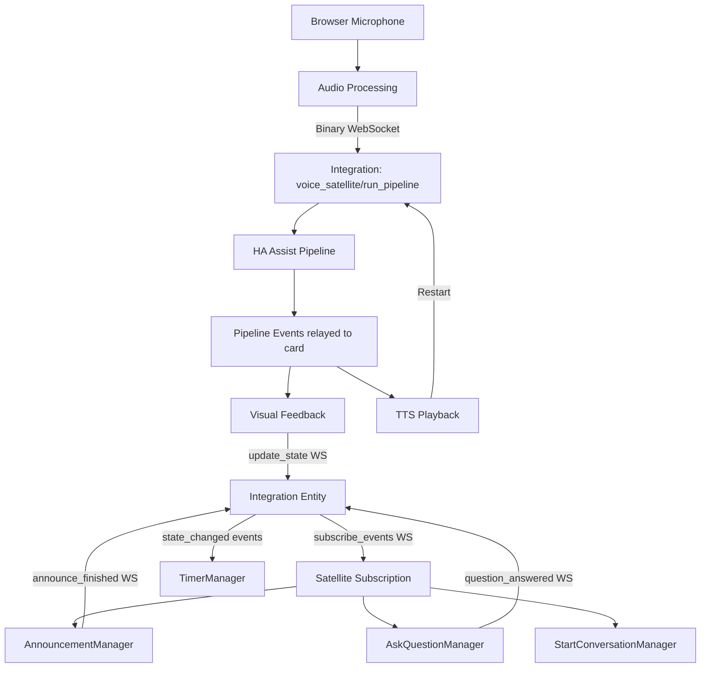

# Voice Satellite Card — Design Document

Current version: 4.0.0

## 1. Overview

Voice Satellite Card is a custom Home Assistant Lovelace card that turns any browser into a full-featured voice satellite with feature parity with physical devices like the Home Assistant Voice Preview Edition. It captures microphone audio, routes it through the **required** [Voice Satellite Card Integration](https://github.com/jxlarrea/voice-satellite-card-integration) to Home Assistant's Assist pipeline, and plays back TTS responses — all without leaving the HA dashboard.

The source is organized as ES6 modules in `src/`, bundled via Webpack + Babel into a single `voice-satellite-card.min.js` for deployment. The card is invisible (`getCardSize() = 0`). All visual feedback is rendered via a global overlay appended to `document.body`, outside HA's Shadow DOM, so it persists across dashboard view changes.

**Critical dependency:** The integration is mandatory. The card routes ALL pipeline communication through the integration's `voice_satellite/run_pipeline` WebSocket subscription. There is no anonymous/standalone pipeline mode.

---

## 2. High-Level Flow



1. The card acquires the browser microphone via `getUserMedia`.
2. Audio is captured via AudioWorklet (or ScriptProcessor fallback), resampled to 16 kHz mono PCM, and sent as binary WebSocket frames every 100 ms.
3. The integration's `voice_satellite/run_pipeline` subscription routes audio through the HA Assist pipeline (wake word → STT → intent → TTS) and relays events back to the card.
4. The card receives pipeline events, updates visual feedback (gradient bar, transcription/response bubbles), and plays the TTS audio.
5. When TTS playback begins, the pipeline is immediately restarted so it listens for the next wake word while audio plays (barge-in support). If the conversation agent signals `continue_conversation`, the card skips the wake word stage and restarts in STT mode for multi-turn dialogues.
6. The cycle repeats indefinitely.

### Integration Communication Channels

| Channel | Direction | Purpose |
|---------|-----------|---------|
| `voice_satellite/run_pipeline` | Card → Integration → Card | Bridged pipeline: card sends audio, receives pipeline events |
| `voice_satellite/subscribe_events` | Integration → Card | Push notifications: announcements, start_conversation, ask_question |
| `voice_satellite/update_state` | Card → Integration | Sync card's pipeline state to the entity (idle/listening/processing/responding) |
| `voice_satellite/announce_finished` | Card → Integration | ACK that announcement playback completed (unblocks integration's `async_announce`) |
| `voice_satellite/question_answered` | Card → Integration | Submit STT transcription for hassil matching |
| `voice_satellite/cancel_timer` | Card → Integration | Cancel a specific timer by ID |
| `state_changed` (HA event bus) | Integration → Card | Timer state changes (active_timers attribute) |

---

## 3. Architecture

### 3.1 Module Structure

The codebase follows a **folder-per-feature** convention. Each feature folder has an `index.js` (the manager class) and helper files for events, comms, and UI. Shared utilities live in `shared/`.

```
voice-satellite-card/
├── src/
│   ├── index.js                          ← Entry point, custom element registration
│   ├── constants.js                      ← State enum, DEFAULT_CONFIG, Timing, BlurReason, EXPECTED_ERRORS
│   ├── logger.js                         ← Shared Logger class
│   ├── styles.css                        ← CSS styles (imported as raw string via webpack)
│   │
│   ├── card/                             ← Main card class + helpers
│   │   ├── index.js                      ← VoiceSatelliteCard (thin orchestrator)
│   │   ├── events.js                     ← State transitions, pipeline dispatch, TTS completion
│   │   ├── comms.js                      ← Satellite state sync (voice_satellite/update_state)
│   │   ├── ui.js                         ← UIManager (overlay, bar, blur, start button, chat, timer DOM)
│   │   ├── chat.js                       ← ChatManager (bubbles, streaming fade)
│   │   ├── double-tap.js                 ← DoubleTapHandler (cancel with touch dedup)
│   │   └── visibility.js                 ← VisibilityManager (tab pause/resume)
│   │
│   ├── audio/                            ← Audio capture + chimes + media playback
│   │   ├── index.js                      ← AudioManager (mic, worklet, send interval)
│   │   ├── processing.js                 ← AudioWorklet/ScriptProcessor setup, resample, buffer
│   │   ├── comms.js                      ← Binary WebSocket audio transmission
│   │   ├── chime.js                      ← Web Audio API chime generation (all chime patterns)
│   │   └── media-playback.js             ← HTML Audio element playback + URL normalization
│   │
│   ├── tts/                              ← TTS playback orchestration
│   │   ├── index.js                      ← TtsManager (browser/remote, streaming, chime facade)
│   │   └── comms.js                      ← Remote media_player service calls
│   │
│   ├── pipeline/                         ← Assist pipeline lifecycle
│   │   ├── index.js                      ← PipelineManager (start/stop/restart, mute polling, retry)
│   │   ├── events.js                     ← Pipeline event handlers (run-start through error)
│   │   └── comms.js                      ← subscribePipelineRun, setupReconnectListener
│   │
│   ├── timer/                            ← Timer countdown + alerts
│   │   ├── index.js                      ← TimerManager (timer state, alert lifecycle)
│   │   ├── events.js                     ← State change processing, dedup
│   │   ├── ui.js                         ← Timer pills, alert overlay, countdown tick
│   │   └── comms.js                      ← Timer cancel via voice_satellite/cancel_timer WS
│   │
│   ├── announcement/                     ← Simple announcements
│   │   └── index.js                      ← AnnouncementManager (chime → media → ACK → restart)
│   │
│   ├── ask-question/                     ← Ask question (STT capture + match feedback)
│   │   ├── index.js                      ← AskQuestionManager (prompt → STT → answer → feedback)
│   │   └── comms.js                      ← question_answered WS command
│   │
│   ├── start-conversation/               ← Start conversation (prompt → STT listening mode)
│   │   └── index.js                      ← StartConversationManager (prompt → restartContinue)
│   │
│   ├── shared/                           ← Cross-feature utilities
│   │   ├── singleton.js                  ← Single-instance guarantee (window.__vsSingleton)
│   │   ├── satellite-subscription.js     ← WS subscription for integration-pushed events
│   │   ├── satellite-notification.js     ← Shared notification lifecycle (dispatch/queue/play/cleanup)
│   │   ├── satellite-state.js            ← Pure entity lookups (getSatelliteAttr, getSwitchState)
│   │   ├── notification-comms.js         ← Shared ACK WebSocket call
│   │   ├── entity-subscription.js        ← HA state_changed subscription pattern
│   │   ├── style-utils.js               ← 9-property bubble styling helper
│   │   └── format.js                     ← Time formatting utility
│   │
│   └── editor/                           ← Config editor + preview
│       ├── index.js                      ← getConfigForm() schema assembler
│       ├── behavior.js                   ← satellite_entity, debug, mic processing
│       ├── media.js                      ← TTS target, volumes, announcement duration
│       ├── timer.js                      ← Timer pill styling (11 fields)
│       ├── bar.js                        ← Activity bar (position, height, gradient, blur)
│       ├── bubbles.js                    ← Bubble style, transcription/response sections
│       └── preview.js                    ← Static editor preview renderer
│
├── webpack.config.js                     ← Webpack config (dev + minified builds)
├── package.json                          ← Version source of truth
├── voice-satellite-card.min.js           ← Production build (committed for HACS)
├── voice-satellite-card.js               ← Debug build with source maps
└── voice-satellite-card.js.map           ← Source map
```

### 3.2 Layering Principles

The codebase enforces strict separation of concerns:

1. **Pure helpers** (`shared/`) — No side effects, no state. Functions like `getSwitchState()`, `formatTime()`, `applyBubbleStyle()` are pure lookups or transformations.

2. **Comms modules** (`*/comms.js`) — WebSocket calls and HA service calls. No DOM, no state, no timers. Each function takes explicit parameters and returns results or fires callbacks. All comms files document "Uses ONLY public accessors on the card instance."

3. **Event modules** (`*/events.js`) — Transform pipeline/entity events into state changes and UI updates. Access manager state via the `mgr` parameter's public accessors. No WebSocket calls.

4. **Manager classes** (`*/index.js`) — Own feature-specific state, wire up subscriptions, delegate to event/comms/UI helpers. All managers receive the card instance via constructor injection.

5. **UIManager** (`card/ui.js`) — The **single owner** of all DOM manipulation. No other module creates, modifies, or removes DOM elements. Other modules request DOM changes through UIManager's public API (e.g., `addChatMessage()`, `showBlurOverlay()`, `syncTimerPills()`).

6. **Card orchestrator** (`card/index.js`) — Thin composition root. Creates all managers, exposes public accessors, delegates lifecycle methods. Contains no business logic.

### 3.3 Singleton Pattern

Only one card instance can own the microphone and pipeline at a time. This is critical because:
- A user may place the card on multiple dashboard views
- HA recreates the custom element when switching views
- Two active AudioContexts would conflict

The singleton state lives on `window.__vsSingleton` (module scope falls back to window namespace so multiple script loads share state):

```javascript
window.__vsSingleton = {
  instance: null,    // The owning card reference
  active: false,     // Whether any instance is active
  starting: false,   // Startup lock (prevents race conditions)
};
```

Key operations:
- `claim(card)` — called after successful mic + pipeline start
- `isOwner(card)` — returns true if no instance is active OR the given card is the owner
- `isActive()` — returns true only after `claim()` succeeds
- `isStarting()` / `setStarting(val)` — startup lock flag, prevents race conditions when multiple cards try to start simultaneously (e.g., view switch during startup)
- `propagateConfig(card)` — when a secondary card calls `setConfig()`, the config is forwarded to the active instance so live config changes take effect

**Gotcha:** Before `claim()`, `isOwner()` returns true for all cards (since `instance` is null). The `isActive()` check gates subscriptions so they only fire after a card has successfully started.

### 3.5 Logger (`logger.js`)

Centralized logging controlled by `config.debug`. All managers receive a reference to the shared Logger instance from the card.

- `log(category, msg, data?)` — Gated by `_debug` flag. Silent in production unless debug is enabled.
- `error(category, msg, data?)` — Always logs (not gated). Errors are never suppressed.
- Console output format: `[VS][category] message`
- The `debug` setter is updated by `setConfig()` whenever the config changes.

### 3.4 Global UI

The card renders nothing in its own Shadow DOM (just a hidden `<div>`). All visible UI lives in a single `#voice-satellite-ui` element appended to `document.body`:

```html
<div id="voice-satellite-ui">
  <div class="vs-blur-overlay"></div>
  <button class="vs-start-btn"><!-- SVG mic icon --></button>
  <div class="vs-chat-container"></div>
  <div class="vs-rainbow-bar"></div>
</div>
```

Timer pills live in a separate `#voice-satellite-timers` container, also on `document.body`.

This design ensures the UI persists when the user navigates between dashboard views — HA destroys and recreates custom elements on navigation, but the global overlay remains.

---

## 4. Entry Point

`src/index.js` registers the custom element and announces the card to HA's card picker:

```javascript
customElements.define('voice-satellite-card', VoiceSatelliteCard);
window.customCards.push({ type: 'voice-satellite-card', ... });
```

A styled console log shows the card version on load (`__VERSION__` is injected at build time from `package.json` via Webpack's DefinePlugin).

---

## 5. Card Orchestrator (`card/index.js`)

`VoiceSatelliteCard` extends `HTMLElement` and composes 11 managers:

| Manager | Purpose |
|---------|---------|
| `AudioManager` | Microphone, AudioWorklet, send interval |
| `TtsManager` | TTS playback (browser + remote), chime facade |
| `PipelineManager` | Pipeline lifecycle (start/stop/restart/retry/mute) |
| `UIManager` | All DOM manipulation |
| `ChatManager` | Chat bubble state, streaming text fade |
| `DoubleTapHandler` | Double-tap to cancel interactions |
| `VisibilityManager` | Tab pause/resume |
| `TimerManager` | Timer entity subscription + pills + alerts |
| `AnnouncementManager` | Announcement playback + ACK |
| `AskQuestionManager` | Question → STT → answer → match feedback |
| `StartConversationManager` | Prompt → STT listening mode |

### 5.1 Lifecycle

**`connectedCallback()`** — Called when HA inserts the element:
1. Clears any pending disconnect timeout
2. Renders the hidden Shadow DOM container
3. If this is an editor preview, renders the static preview and returns
4. Ensures the global UI exists
5. Sets up visibility change listener
6. If no singleton is active and we have a connection, starts listening

**`disconnectedCallback()`** — Called when HA removes the element (e.g., view navigation):
- Sets a 100ms grace period (`DISCONNECT_GRACE`) before tearing down. This prevents the pipeline from restarting when the user simply switches views.

**`set hass(hass)`** — Called by HA when state updates arrive:
1. Editor previews return immediately
2. If this is the active owner: updates TimerManager and retries satellite subscription if needed
3. If not yet started: acquires connection, ensures global UI, starts listening

**`setConfig(config)`** — Called when the user saves config in the editor:
1. Captures whether satellite_entity was previously empty
2. Merges config with defaults
3. Updates logger debug flag
4. Applies styles to the global UI
5. Updates editor preview if in preview context
6. Propagates config to the active singleton instance
7. **Config reactivity:** If satellite_entity was just configured (empty → value), triggers startup without requiring a page reload

**Gotcha — Config reactivity:** When a user adds a satellite entity in the editor and saves, `set hass` may have already returned early (before `_hasStarted` is set) because `satellite_entity` was empty at the time. `setConfig` detects this transition and triggers startup directly.

### 5.2 Event Delegation

The card delegates all event handling to free functions in `card/events.js`:

- `setState(card, newState)` — Updates card state, triggers UIManager update, syncs state to integration (with barge-in guard: skips idle/listening sync while TTS is playing)
- `startListening(card)` — Claims singleton, starts mic + pipeline, subscribes to satellite events, sets up double-tap
- `handleStartClick(card)` — Ensures AudioContext on gesture, then calls `startListening`
- `onTTSComplete(card, playbackFailed)` — Handles post-TTS cleanup: continue conversation, done chime, clear UI, play queued notifications
- `handlePipelineMessage(card, message)` — Dispatches pipeline events by type to PipelineManager handlers (with guards for paused/restarting)

---

## 6. Audio System (`audio/`)

### 6.1 AudioManager

Manages the microphone lifecycle:

1. **Acquisition** — `startMicrophone()` creates an AudioContext (16 kHz requested), gets `getUserMedia` with configurable constraints (noise suppression, echo cancellation, auto gain control, voice isolation).

2. **Capture** — Tries AudioWorklet first (inline processor via Blob URL), falls back to ScriptProcessor (2048 buffer). Both push `Float32Array` chunks to `audioBuffer`.

3. **Send loop** — `startSending(binaryHandlerIdGetter)` starts a 100ms `setInterval` that:
   - Combines all buffered chunks into one `Float32Array`
   - Resamples to 16 kHz if the browser's actual sample rate differs (linear interpolation)
   - Converts to 16-bit PCM (`Int16Array`)
   - Sends as binary WebSocket frame with the handler ID byte prefix

4. **Pause/Resume** — On tab hide: disables audio tracks and stops sending. On tab show: flushes stale audio buffer, re-enables tracks, resumes AudioContext if suspended.

**Gotcha — AudioWorklet inline code:** The worklet processor is defined as an inline string, converted to a Blob URL, loaded as a module, then the URL is immediately revoked. This avoids CORS issues with external worklet files in HA's WebView.

### 6.2 Binary Audio Protocol

Audio is sent over the existing HA WebSocket connection as binary frames:

```
[handler_id: 1 byte][pcm_data: N bytes of Int16Array]
```

The `handler_id` byte is obtained from the init event of `voice_satellite/run_pipeline`. HA's WebSocket implementation routes the binary data to the registered handler.

### 6.3 Chime System

Five predefined chime patterns synthesized via Web Audio API oscillators:

| Chime | Pattern | Used For |
|-------|---------|----------|
| `CHIME_WAKE` | 3-note ascending sine (C5→E5→G5) | Wake word detected |
| `CHIME_DONE` | 2-note descending sine (G5→E5) | Interaction complete |
| `CHIME_ERROR` | 2-note descending square (quiet) | Error / unmatched answer |
| `CHIME_ANNOUNCE` | 2-note ding-dong sine (G5→D5) | Pre-announcement |
| `CHIME_ALERT` | 3-note rising sine (A5→E5→A5) | Timer finished (loops every 3s) |

Single-note chimes (`playChime`) use one oscillator with frequency steps. Multi-note chimes (`playMultiNoteChime`) create separate oscillators per note with individual envelopes.

Volume scaled to max 0.5: `(config.chime_volume / 100) * 0.5`. Error chime additionally reduced to 30%.

### 6.4 Media Playback

`media-playback.js` provides two utilities:
- `buildMediaUrl(path)` — Normalizes a URL path: full URLs pass through, root-relative paths are prefixed with `window.location.origin`
- `playMediaUrl(url, volume, callbacks)` — Creates an `<audio>` element, wires `onended`/`onerror` callbacks, returns the element for external stop

---

## 7. TTS Playback (`tts/`)

### 7.1 TtsManager

Handles two playback targets:

**Browser playback** — Creates an HTML Audio element via `playMediaUrl()`. Includes a 30-second watchdog timer that forces completion if the `onended` event never fires (workaround for HA Companion App WebView quirks).

**Remote playback** — Calls `media_player.play_media` on the configured `tts_target` entity. Uses a 2-second delay before reporting completion (estimation, since there's no feedback from the media player).

### 7.2 Streaming TTS

If the pipeline's `run-start` event includes `tts_output.stream_response: true`, the TTS URL is stored. When `intent-progress` fires with `tts_start_streaming: true`, playback begins immediately — before the full TTS audio is generated. This reduces perceived latency. No pipeline restart at this point — text chunks are still arriving.

### 7.3 Chime Facade

`TtsManager.playChime(type)` maps `'wake'`/`'error'`/`'done'` to the corresponding chime pattern and delegates to `audio/chime.js`. This keeps chime logic centralized while letting all code paths call `tts.playChime()`.

### 7.4 TTS Stop Safety

When stopping TTS playback (`tts.stop()`), `onended` and `onerror` handlers are nulled BEFORE calling `pause()`. Otherwise the pause triggers `onended`, which calls `_onComplete()`, which can trigger continue-conversation or cleanup incorrectly (ghost events).

---

## 8. Pipeline System (`pipeline/`)

### 8.1 PipelineManager

The pipeline manager handles the full lifecycle of the bridged pipeline:

**Starting (`start()`):**
1. Checks mute state — if the mute switch is on, shows error bar and polls every 2 seconds until unmuted
2. Cleans up any previous subscription
3. Sets up the reconnect listener
4. Subscribes to `voice_satellite/run_pipeline` via the integration
5. Waits for the synthetic `init` event that carries the binary handler ID
6. Starts audio sending

**Stopping (`stop()`):**
- Stops audio sending, clears mute poll timer, unsubscribes from the pipeline

**Restarting (`restart(delay)`):**
- Guards against concurrent restarts via `_isRestarting` flag
- Stops, waits `delay` ms, then starts again
- On start failure: shows error bar, sets `serviceUnavailable`, retries with backoff

**Continue conversation (`restartContinue(conversationId, opts)`):**
- Stops and restarts with `start_stage: 'stt'` (skipping wake word)
- Optionally sets `askQuestionCallback` for STT-only mode
- Optionally passes `extra_system_prompt` for start_conversation

### 8.2 Mute Polling

When the mute switch is on, the pipeline doesn't start. Instead, `start()` shows an error bar and schedules a retry every 2 seconds:

```javascript
if (getSwitchState(hass, entity, 'mute') === true) {
  this._muteCheckId = setTimeout(() => this.start(), MUTE_POLL_INTERVAL);
  return;
}
```

When the mute switch is turned off, the next poll starts the pipeline normally.

### 8.3 Stale Event Filtering

The bridged pipeline can receive events from a previous pipeline run that hasn't fully torn down on the server. The manager uses three flags to filter stale events:

- `_runStartReceived` — Set to `true` on `run-start`. All events before the first `run-start` for a given subscription are ignored.
- `_wakeWordPhase` — Set `true` on `wake_word-start`, `false` on valid `wake_word-end`. A `run-end` during wake word phase (without error) is stale.
- `_errorReceived` — Set `true` on `error`. Allows `run-end` to proceed even during wake word phase if an error preceded it.

**Gotcha — Empty wake_word-end:** When the pipeline is stopped/restarted, the server sends a `wake_word-end` with empty `wake_word_output`. This is not a real wake word detection — the manager ignores it to avoid entering a retry loop.

### 8.4 Retry Backoff

On failure, `calculateRetryDelay()` uses linear backoff:
- `delay = min(RETRY_BASE_DELAY × retryCount, MAX_RETRY_DELAY)`
- Base: 5000ms, max: 30000ms
- Reset on successful `wake_word-start` or reconnection

### 8.5 Pipeline Events

Events flow from `voice_satellite/run_pipeline` → `card.onPipelineMessage()` → `handlePipelineMessage()` → individual handlers on PipelineManager:

| Event | Handler | Action |
|-------|---------|--------|
| `run-start` | `handleRunStart` | Store streaming TTS URL, set state (LISTENING or STT for continue) |
| `wake_word-start` | `handleWakeWordStart` | Track recovery from service unavailable |
| `wake_word-end` | `handleWakeWordEnd` | Play wake chime (if enabled), show blur, enter WAKE_WORD_DETECTED |
| `stt-start` | (inline) | Set state STT |
| `stt-end` | `handleSttEnd` | Show transcription bubble, invoke askQuestionCallback if set |
| `intent-start` | (inline) | Set state INTENT |
| `intent-progress` | `handleIntentProgress` | Stream response text, start streaming TTS |
| `intent-end` | `handleIntentEnd` | Show final response, handle continue_conversation, handle errors |
| `tts-start` | (inline) | Set state TTS |
| `tts-end` | `handleTtsEnd` | Play TTS audio (if not already streaming), restart pipeline |
| `run-end` | `handleRunEnd` | Clean up: clear chat, hide blur, restart (or defer if TTS playing) |
| `error` | `handleError` | Expected errors: restart silently. Unexpected: error bar + backoff retry |

### 8.6 Wake Sound Switch

Before playing the wake chime, `handleWakeWordEnd` checks the integration's `wake_sound` switch via `getSwitchState()`. This function looks up the switch entity through HA's entity registry (finding the switch with `translation_key: 'wake_sound'` on the same device as the satellite entity).

The done chime after TTS playback follows the same pattern.

**Gotcha — getSwitchState lookup:** The function uses `hass.entities` (HA frontend entity registry cache) to find sibling switch entities by `device_id` + `translation_key`. This is more reliable than reading `extra_state_attributes` on the satellite entity, which can be stale if the state_changed listener wasn't set up in time.

### 8.7 Deferred Run-End

When `run-end` arrives while TTS is playing, `pendingRunEnd = true`. The cleanup is deferred. When `onTTSComplete()` eventually fires, it handles the full cleanup. `finishRunEnd()` clears chat, hides blur, sets state to IDLE, then restarts pipeline (unless `serviceUnavailable` is true, in which case retry is already scheduled).

---

## 9. Timer System (`timer/`)

### 9.1 TimerManager

Timers are managed server-side by HA's intent system. The integration registers as a timer handler; HA routes `HassStartTimer`/`HassUpdateTimer`/`HassCancelTimer` intents to it. The integration stores active timers in the satellite entity's `active_timers` attribute.

The card watches the satellite entity's state via `subscribeToEntity()` (HA's `state_changed` event bus). When the `active_timers` attribute changes:

1. **processStateChange** — JSON-based dedup prevents duplicate processing. Compares current timer IDs with known IDs to detect additions and removals.
2. **syncTimers** — Creates/updates timer objects with server-side `started_at` (epoch seconds) for accurate elapsed time calculation.
3. **Tick** — A 1-second `setInterval` updates `secondsLeft` for each timer and refreshes pill displays.
4. **Alert** — When timers are removed with `last_timer_event: "finished"`, shows a full-screen alert with looping chime.

### 9.2 Timer Cancellation

Timers can be cancelled two ways:
- **Voice:** "Cancel the timer" → HA's intent system processes it normally
- **Double-tap:** Double-tapping a timer pill sends `voice_satellite/cancel_timer` to the integration, which calls `timer_manager.cancel_timer(timer_id)` on HA's intent system. The pill is removed immediately (optimistic UI) while the server-side cancel propagates.

### 9.3 Timer UI

Timer pills render in a separate `#voice-satellite-timers` container positioned based on `timer_position` config (top-left, top-right, bottom-left, bottom-right). Each pill shows:
- Timer icon (⏱)
- Countdown in HH:MM:SS format
- Progress bar (percentage of total time remaining)

Timer alert: Full-screen overlay centered on viewport, repeating `CHIME_ALERT` every 3 seconds, with blur overlay (`BlurReason.TIMER`). Auto-dismiss after `timer_finished_duration` seconds (0 = manual dismiss only via double-tap).

---

## 10. Notification System

Three notification features share a common lifecycle defined in `shared/satellite-notification.js`:

### 10.1 Event Flow

1. **Integration pushes event** via `voice_satellite/subscribe_events` subscription
2. **`dispatchSatelliteEvent()`** routes to the correct manager based on flags:
   - `ask_question: true` → AskQuestionManager
   - `start_conversation: true` or `type === "start_conversation"` → StartConversationManager
   - Otherwise → AnnouncementManager
3. **Pipeline-busy queuing** — If the card is in an active interaction or TTS is playing, the notification is queued. Queued notifications play after `onTTSComplete()` calls `playQueued()`.
4. **Hidden-tab queuing** — If the tab is hidden, events are queued and replayed when the tab becomes visible. Only the latest event is kept.
5. **Dedup** — Monotonic announce IDs prevent duplicate processing.

### 10.2 Playback Orchestration (`playNotification`)

All three managers use the same playback flow:

1. Show blur overlay (`BlurReason.ANNOUNCEMENT`)
2. Show rainbow bar in speaking mode
3. Set announcement mode for passive notifications (centers chat container on viewport)
4. Play pre-announcement chime (or custom media if `preannounce_media_id` provided)
5. Show message as chat bubble (passive: `'announcement'` type centered; interactive: `'assistant'` type follows chat layout)
6. Play main media
7. Call manager-specific `_onComplete` handler

### 10.3 AnnouncementManager

After playback:
1. ACK to integration (`announce_finished`)
2. Restart pipeline (HA cancels the running pipeline when triggering announcements)
3. After configurable delay (`announcement_display_duration`): play done chime, clear UI

### 10.4 StartConversationManager

After playback:
1. ACK to integration
2. Clear announcement UI
3. Show pipeline blur overlay
4. `restartContinue(null, { extra_system_prompt })` — Restarts pipeline in STT mode, skipping wake word, with the automation's system prompt

### 10.5 AskQuestionManager

After playback:
1. ACK to integration (signals question was played)
2. Switch from centered announcement mode to interactive mode
3. Play wake chime (delayed 500ms for chime settle — prevents false VAD trigger from mic picking up the chime)
4. `restartContinue(null, { end_stage: 'stt', onSttEnd })` — STT-only pipeline
5. On STT result: send answer via `voice_satellite/question_answered`
6. Integration matches against hassil templates, returns `{ matched, id }`
7. Play done chime (matched) or error chime + flash bar (unmatched)
8. Cleanup with safety timeouts

**Cancel flow:** `cancel()` handles mid-flow cancellation (triggered by double-tap or tab hide):
- Clears all pending timeouts (chime settle, STT safety, cleanup)
- Sends empty answer to release the integration's server-side `_question_event`
- Hides the ANNOUNCEMENT blur overlay

**STT safety timeout:** If the STT pipeline never produces a result (timeout, error, etc.), a 30-second safety timer sends an empty answer to release the integration's blocking event. The `_answerSent` flag prevents double-submission.

---

## 11. Satellite Subscription (`shared/satellite-subscription.js`)

A single WebSocket subscription to `voice_satellite/subscribe_events` delivers all notification events:

```javascript
connection.subscribeMessage(onEvent, {
  type: 'voice_satellite/subscribe_events',
  entity_id: config.satellite_entity,
});
```

The subscription is:
- **Idempotent** — No-op if already subscribed
- **Owner-only** — Only the singleton owner subscribes
- **Reconnect-aware** — Re-subscribes on the connection's `ready` event
- **Refreshable** — `refreshSatelliteSubscription()` tears down and re-establishes (called on tab resume to recover from stale connections)

---

## 12. Entity Subscription (`shared/entity-subscription.js`)

A reusable pattern for watching HA entity state changes. Used by TimerManager to monitor `active_timers`:

```javascript
subscribeToEntity(manager, connection, entityId, onAttrs, logTag);
```

Features:
- Subscribes to `state_changed` events filtered by entity_id
- Performs immediate state check on subscribe (catches existing state)
- Re-subscribes on connection `ready` event
- Cleanup via `unsubscribeEntity(manager)`

---

## 13. Satellite State Helpers (`shared/satellite-state.js`)

Two pure lookup functions used across all managers:

### `getSatelliteAttr(hass, entityId, name)`
Reads an attribute from the satellite entity's HA state cache.

### `getSwitchState(hass, satelliteId, translationKey)`
Reads a sibling switch entity's state. The lookup strategy:
1. **Primary:** Search `hass.entities` (frontend entity registry cache) for a switch with matching `device_id` and `translation_key` on the `voice_satellite` platform. Read its state from `hass.states`.
2. **Fallback:** Read `extra_state_attributes` on the satellite entity (may be stale).

Used for:
- `mute` switch — Blocks pipeline start when on
- `wake_sound` switch — Controls chime playback (wake, done chimes)

---

## 14. Visibility Management (`card/visibility.js`)

Handles browser tab show/hide transitions:

### Tab Hidden
1. Cancel any in-progress ask_question flow (prevents cleanup timers firing after resume)
2. If in an active interaction: clear chat, hide blur, clear continue state, stop TTS
3. After 500ms debounce: set state PAUSED, disable audio tracks

**Gotcha — No `pipeline.stop()` on hide:** Calling `stop()` creates a race condition where the server is still cancelling the old pipeline when `resume()` starts a new one, causing `async_accept_pipeline_from_satellite()` to silently fail. The `restart(0)` call in `_resume()` handles the properly sequenced stop→start.

### Tab Visible
1. Resume AudioContext (browser suspends it in background)
2. Clear `_isPaused` flag synchronously (no stale events can slip through the gap)
3. Reset pipeline state via `resetForResume()`
4. If a satellite event was queued while hidden: let the replayed event's flow manage the pipeline
5. Otherwise: refresh satellite subscription and restart pipeline

---

## 15. Double-Tap Handler (`card/double-tap.js`)

Listens on `document` for touch/click events. On double-tap (within 400ms threshold):

**Priority order:**
1. **Timer alert active** → Dismiss alert
2. **Notification playing** → ACK each active notification, stop audio, clear UI, cancel ask_question's server-side event, restart pipeline
3. **Active interaction** → Stop TTS, cancel ask_question, clear continue state, set IDLE, clear chat/blur, play done chime, restart pipeline

Touch/click deduplication prevents double-firing on touch devices (touchstart fires before click).

---

## 16. Chat System (`card/chat.js`)

Manages chat message state. All DOM operations delegate to UIManager.

**Bubble types:**
- `user` — Transcription bubble (styled with `transcription_*` config)
- `assistant` — Response bubble (styled with `response_*` config)
- `announcement` — Notification message (uses `response_*` styling, always centered)

**Streaming text fade:** During `intent-progress` streaming, the last 24 characters fade from opaque to transparent using per-character `<span>` elements with decreasing opacity. When the final text arrives in `intent-end`, the full text replaces the faded version.

**Layout modes:**
- `chat` — User bubbles right-aligned, assistant left-aligned
- `centered` — All bubbles centered

**Gotcha — `streamEl` must be cleared between turns:** If not reset in `handleIntentEnd` and continue-conversation transitions, streaming text appends to the previous turn's bubble.

---

## 17. UI Manager (`card/ui.js`)

Single owner of all DOM manipulation. Key responsibilities:

### Blur Overlay (Reference-Counted)
Multiple features can request the blur overlay simultaneously (pipeline, timer, announcement). Uses a `_blurReasons` object to track active reasons. The overlay hides only when all reasons are cleared. Forgetting to clear a reason leaves a permanent blur.

### Rainbow Bar
State-driven animation speeds:
- `listening` — 3s flow (slow)
- `processing` — 0.5s flow (fast)
- `speaking` — 2s flow (medium)
- `error-mode` — Red gradient, 2s flow
- `error-flash` — 3x flash animation (ask_question unmatched answer)

### Start Button
Floating mic button with pulse animation. Shows on initial load, microphone permission denied, microphone not found, or generic mic error.

### Chat Container
Fixed position, centered horizontally. Bottom offset accounts for bar height. `announcement-mode` class centers vertically (for passive announcements). Notification system manages the toggle between announcement mode and normal mode.

### Timer DOM
Timer pills, alert overlay, progress bar updates, expired pill animations — all coordinated by TimerManager but executed by UIManager.

---

## 18. State Machine

The card tracks its state via a string enum:

```
IDLE → CONNECTING → LISTENING → WAKE_WORD_DETECTED → STT → INTENT → TTS → IDLE
                                                                          ↓
                                                                    (continue conversation)
                                                                          ↓
                                                                    STT → INTENT → TTS
```

| State | Meaning | Bar |
|-------|---------|-----|
| `IDLE` | Waiting / inactive | Hidden |
| `CONNECTING` | Starting mic + pipeline | Hidden |
| `LISTENING` | Pipeline running, waiting for wake word | Hidden |
| `PAUSED` | Tab hidden | Hidden |
| `WAKE_WORD_DETECTED` | Wake word heard, now capturing speech | Visible (slow) |
| `STT` | Capturing speech | Visible (slow) |
| `INTENT` | Processing intent / generating response | Visible (fast) |
| `TTS` | Playing response audio | Visible (medium) |
| `ERROR` | Error state | Hidden |

State changes are synced to the integration entity via `voice_satellite/update_state`. The integration maps card states to HA satellite states:

| Card State | HA State |
|-----------|----------|
| IDLE, CONNECTING, LISTENING, PAUSED, ERROR | `idle` |
| WAKE_WORD_DETECTED, STT | `listening` |
| INTENT | `processing` |
| TTS | `responding` |

---

## 19. Configuration

### 19.1 Config Defaults

`DEFAULT_CONFIG` in `constants.js` defines all configuration keys with their defaults:

| Key | Type | Default | Description |
|-----|------|---------|-------------|
| **Behavior** ||||
| `satellite_entity` | string | `''` | **Required.** Integration satellite entity ID (e.g., `assist_satellite.kitchen_tablet`) |
| `start_listening_on_load` | bool | `true` | Auto-start pipeline on page load (internal, not in editor) |
| `double_tap_cancel` | bool | `true` | Enable double-tap to cancel (internal, not in editor) |
| `debug` | bool | `false` | Enable debug logging to browser console |
| `chime_volume` | number | `100` | Chime volume (0–100) |
| `tts_volume` | number | `100` | TTS playback volume (0–100) |
| `tts_target` | string | `''` | Remote media_player entity for TTS (empty = browser playback) |
| **Microphone Processing** ||||
| `noise_suppression` | bool | `true` | WebRTC noise suppression |
| `echo_cancellation` | bool | `true` | WebRTC echo cancellation |
| `auto_gain_control` | bool | `true` | WebRTC auto gain control |
| `voice_isolation` | bool | `false` | Experimental voice isolation (not supported on all browsers) |
| **Timer Pill** ||||
| `timer_position` | string | `'top-right'` | Pill container position: `top-left`, `top-right`, `bottom-left`, `bottom-right` |
| `timer_font_size` | number | `20` | Font size in px |
| `timer_font_family` | string | `'inherit'` | Font family |
| `timer_font_color` | string | `'#444444'` | Text color |
| `timer_font_bold` | bool | `true` | Bold text |
| `timer_font_italic` | bool | `false` | Italic text |
| `timer_background` | string | `'#ffffff'` | Pill background color |
| `timer_border_color` | string | `'rgba(100, 200, 150, 0.5)'` | Pill border color |
| `timer_padding` | number | `16` | Pill padding in px |
| `timer_rounded` | bool | `true` | Rounded corners |
| `timer_finished_duration` | number | `60` | Seconds to show finished alert (0 = manual dismiss only) |
| **Announcements** ||||
| `announcement_display_duration` | number | `5` | Seconds to display announcement text after playback |
| **Activity Bar** ||||
| `bar_position` | string | `'bottom'` | Bar position: `top` or `bottom` |
| `bar_height` | number | `16` | Bar height in px |
| `bar_gradient` | string | *(rainbow)* | Comma-separated CSS colors for the animated gradient |
| `background_blur` | bool | `true` | Enable blur overlay behind UI |
| `background_blur_intensity` | number | `5` | Blur intensity in px |
| **Transcription Bubble** ||||
| `transcription_font_size` | number | `20` | Font size in px |
| `transcription_font_family` | string | `'inherit'` | Font family |
| `transcription_font_color` | string | `'#444444'` | Text color |
| `transcription_font_bold` | bool | `true` | Bold text |
| `transcription_font_italic` | bool | `false` | Italic text |
| `transcription_background` | string | `'#ffffff'` | Background color |
| `transcription_border_color` | string | `'rgba(0, 180, 255, 0.5)'` | Border color |
| `transcription_padding` | number | `16` | Padding in px |
| `transcription_rounded` | bool | `true` | Rounded corners |
| **Response Bubble** ||||
| `show_response` | bool | `true` | Show assistant response bubble |
| `response_font_size` | number | `20` | Font size in px |
| `response_font_family` | string | `'inherit'` | Font family |
| `response_font_color` | string | `'#444444'` | Text color |
| `response_font_bold` | bool | `true` | Bold text |
| `response_font_italic` | bool | `false` | Italic text |
| `response_background` | string | `'#ffffff'` | Background color |
| `response_border_color` | string | `'rgba(100, 200, 150, 0.5)'` | Border color |
| `response_padding` | number | `16` | Padding in px |
| `response_rounded` | bool | `true` | Rounded corners |
| **Layout** ||||
| `bubble_style` | string | `'chat'` | Bubble layout style: `chat` (left/right aligned) or `centered` |
| `bubble_container_width` | number | `85` | Chat container width as % of viewport |

### 19.2 Editor

The editor uses HA's `ha-form` schema system. Each section is defined in its own file:

| File | Section |
|------|---------|
| `behavior.js` | Satellite entity selector (required), debug toggle, mic processing expandable |
| `media.js` | TTS target, volumes, announcement duration |
| `timer.js` | Timer pill expandable (11 style fields) |
| `bar.js` | Activity bar expandable (position, height, gradient, blur) |
| `bubbles.js` | Bubble style, container width, transcription expandable, response expandable |

The editor assembler (`editor/index.js`) concatenates all schemas and merges label/helper maps into `getConfigForm()`.

### 19.3 Preview

`editor/preview.js` renders a static preview inside the card's Shadow DOM when it detects it's inside HA's card editor (via ancestor element detection: `HUI-CARD-PREVIEW` or `HUI-CARD[preview]` or any tag containing "PREVIEW").

The preview shows:
- Checkered transparency background (light/dark mode aware)
- Rainbow bar with animation
- Sample chat bubbles ("What's the temperature outside?" / "It's currently 75°F and sunny.")
- Timer pill with mock countdown (00:04:32)

All preview elements respect the current config for live style updates.

---

## 20. Build System

### 20.1 Dependencies

```json
{
  "@babel/core": "^7.24.0",
  "@babel/preset-env": "^7.24.0",
  "babel-loader": "^9.1.3",
  "webpack": "^5.90.0",
  "webpack-cli": "^5.1.4"
}
```

All are devDependencies. There are no runtime dependencies — the card is a self-contained single-file bundle.

### 20.2 Build Pipeline

**Webpack** bundles all ES6 modules into two outputs:
- `voice-satellite-card.js` — Unminified with source maps (debugging)
- `voice-satellite-card.min.js` — Minified production build (committed for HACS)

**Babel** transpiles ES6+ features for broader browser support.

**CSS** is imported as a raw string via Webpack's `asset/source` rule and injected into the document head at runtime by UIManager.

**Version** is defined only in `package.json` and injected via `DefinePlugin` as `__VERSION__`.

Build command: `npm run build`

### 20.3 `seamlessGradient` Utility

The gradient bar animation uses `background-position` keyframes that move from `0% 50%` to `200% 50%`. For the animation to loop seamlessly, the gradient must wrap without a hard edge. The `seamlessGradient()` function in `constants.js` handles this by appending the first color to the end of the color list:

```javascript
// Input:  "red, green, blue"
// Output: "linear-gradient(90deg, red, green, blue, red)"
```

Without the duplicated first color, the animation would snap from the last color back to the first on each loop iteration.

---

## 21. Timing Constants

All timing values are centralized in `constants.js`:

| Constant | Value | Purpose |
|----------|-------|---------|
| `DOUBLE_TAP_THRESHOLD` | 400ms | Max interval between taps for double-tap |
| `TIMER_CHIME_INTERVAL` | 3000ms | Interval between alert chime loops |
| `PILL_EXPIRE_ANIMATION` | 400ms | Timer pill fade-out animation duration |
| `PLAYBACK_WATCHDOG` | 30000ms | Force-complete TTS if `onended` never fires |
| `RECONNECT_DELAY` | 2000ms | Delay before restarting pipeline after reconnect |
| `INTENT_ERROR_DISPLAY` | 3000ms | How long to show error bar for intent errors |
| `NO_MEDIA_DISPLAY` | 3000ms | Delay before completing text-only announcements |
| `ASK_QUESTION_CLEANUP` | 2000ms | Safety timeout for sendAnswer promise |
| `ASK_QUESTION_STT_SAFETY` | 30000ms | Safety timeout if STT never produces a result |
| `MAX_RETRY_DELAY` | 30000ms | Maximum backoff delay |
| `RETRY_BASE_DELAY` | 5000ms | Base delay for linear backoff |
| `VISIBILITY_DEBOUNCE` | 500ms | Debounce before pausing on tab hide |
| `DISCONNECT_GRACE` | 100ms | Grace period before teardown on disconnect |
| `CHIME_SETTLE` | 500ms | Delay after wake chime before starting STT |

---

## 22. Error Handling

### Expected Pipeline Errors

These errors are normal and trigger a silent restart:
- `timeout` — Pipeline inactivity timeout
- `wake-word-timeout` — Wake word detection timeout
- `stt-no-text-recognized` — VAD ended but no speech detected
- `duplicate_wake_up_detected` — Multiple wake word detections (note: underscores, not dashes — HA API inconsistency)

If the card was in an interacting state, UI is cleaned up and done chime plays before restart.

### Unexpected Pipeline Errors

All other errors: show error bar (red gradient), play error chime, set `serviceUnavailable = true`, retry with linear backoff.

### Service Recovery

When `wake_word-start` fires after a period of `serviceUnavailable`, a 2-second recovery timer starts. If still `serviceUnavailable` when it fires: clear error bar, reset retry count. This prevents premature recovery clearing from transient events.

### Connection Recovery

The `setupReconnectListener` listens for the connection's `ready` event (HA reconnect). On reconnect: reset retry state, clear error bar, restart pipeline after 2-second delay (or defer if tab is paused).

---

## 23. Cross-Repo Gotchas

These are the non-obvious coupling points between the card and the integration:

1. **Pipeline event relay** — The integration's `on_pipeline_event()` relays HA pipeline events to the card via `connection.send_event()`. The card expects the same event format as HA's `assist_pipeline/run` but receives it through a different WS subscription (`voice_satellite/run_pipeline`).

2. **Init event** — The `voice_satellite/run_pipeline` handler sends a synthetic `{ type: "init", handler_id: N }` event before the real pipeline events. This is how the card gets the binary handler ID for audio transmission. The card blocks on this event before starting audio.

3. **Stale event filtering (both sides)** — The integration gates on `_pipeline_run_started` (blocks events before run-start). The card uses `_runStartReceived`, `_wakeWordPhase`, and `_errorReceived` to filter events from overlapping pipeline runs.

4. **Pipeline stop protocol** — When replacing a pipeline run, the integration sends an empty bytes stop signal to the audio queue. It waits for the old task to exit naturally (3s timeout), only force-cancelling as a last resort. Immediate cancellation would race with the stop signal and leave orphaned HA pipeline tasks.

5. **Announcement blocking** — `async_announce()` blocks until the card sends `announce_finished`. If the card disconnects, `unregister_satellite_subscription()` releases the blocking event to prevent indefinite hangs.

6. **Ask question two-phase flow:**
   - Phase 1: Announcement playback (reuses `async_announce` flow)
   - Phase 2: STT capture (card sends `question_answered`, integration matches with hassil)
   - The `question_answered` WS handler waits for `_question_match_event` to get the hassil result before responding to the card
   - **Race condition:** `_question_match_result` is intentionally NOT cleared in the `finally` block because the asyncio scheduler might run `finally` before the WS handler reads the result

7. **Timer attribute immutability** — The integration creates new lists (not in-place mutation) for `_active_timers` on every change. In-place mutation would share the reference with the previously written state, causing HA to suppress the `state_changed` event (old == new).

8. **Screensaver keep-alive** — The integration sends `homeassistant.turn_off` every 5 seconds to the configured screensaver entity while the satellite is non-idle. This keeps the screen on during interactions.

9. **State sync ordering** — The card skips syncing `idle`/`listening` states while TTS is playing (barge-in scenario). This prevents the integration from showing `idle` while the user is still hearing the response.

---

## 24. Implementation Checklist

When recreating or modifying this card, verify:

**Architecture:**
- [ ] All comms files take `card` as first parameter, use only public accessors
- [ ] Helper files use public getters/setters, never `mgr._privateField`
- [ ] All WebSocket/service calls isolated in comms files
- [ ] All audio creation (AudioContext, Audio, oscillators) in `audio/` module
- [ ] All DOM manipulation in `card/ui.js`

**Pipeline:**
- [ ] Pipeline communicates through `voice_satellite/run_pipeline`, not `assist_pipeline/run`
- [ ] Init event provides binary handler ID (not `runner_data.stt_binary_handler_id`)
- [ ] No idle timeout — server manages pipeline lifecycle
- [ ] Stale event filtering: `_runStartReceived`, `_wakeWordPhase`, `_errorReceived`
- [ ] Empty `wake_word-end` (no `wake_word_id`) is ignored (pipeline restart artifact)
- [ ] `isRestarting` flag prevents concurrent restarts
- [ ] Mute switch blocks pipeline start with 2s polling

**TTS:**
- [ ] `handleTtsEnd()` calls `tts.play()` then `pipeline.restart(0)` for barge-in
- [ ] `stop()` nulls `onended`/`onerror` before pausing (ghost event prevention)
- [ ] Watchdog (30s) forces completion if no audio events
- [ ] Done chime controlled by `wake_sound` switch, suppressed for remote TTS
- [ ] Streaming TTS: no restart at `tts_start_streaming`, skip duplicate at `tts-end`

**Notifications:**
- [ ] All three managers use `satellite-notification.js` lifecycle
- [ ] Events delivered via `voice_satellite/subscribe_events` (not entity attributes)
- [ ] Pipeline-busy queuing, played via `playQueued()` on TTS complete
- [ ] Hidden-tab queuing with visibility replay
- [ ] Passive announcements: centered (`announcement-mode`), `'announcement'` bubble type
- [ ] Interactive notifications: normal chat layout, `'assistant'` bubble type
- [ ] Ask-question: ACK before STT, chime settle delay, STT safety timeout, `_answerSent` guard
- [ ] Ask-question: `askQuestionHandled` prevents `handleRunEnd` cleanup
- [ ] Start-conversation: clears UI before entering STT mode with `extra_system_prompt`

**Singleton & UI:**
- [ ] `window.__vsSingleton` for cross-bundle state (`instance`, `active`, `starting`)
- [ ] `isStarting()`/`setStarting()` startup lock prevents concurrent start races
- [ ] `disconnectedCallback` 100ms grace period for view switch detection
- [ ] Config propagated to active instance via `propagateConfig`
- [ ] Config reactivity: startup triggered when satellite_entity goes from empty to set
- [ ] Blur uses reference counting with `BlurReason` strings
- [ ] `chat.streamEl` cleared between conversation turns

**Version:**
- [ ] Card version in `package.json` only (injected via DefinePlugin)
- [ ] Integration version in 3 places: `manifest.json`, `assist_satellite.py` (sw_version), `DESIGN.md` header
