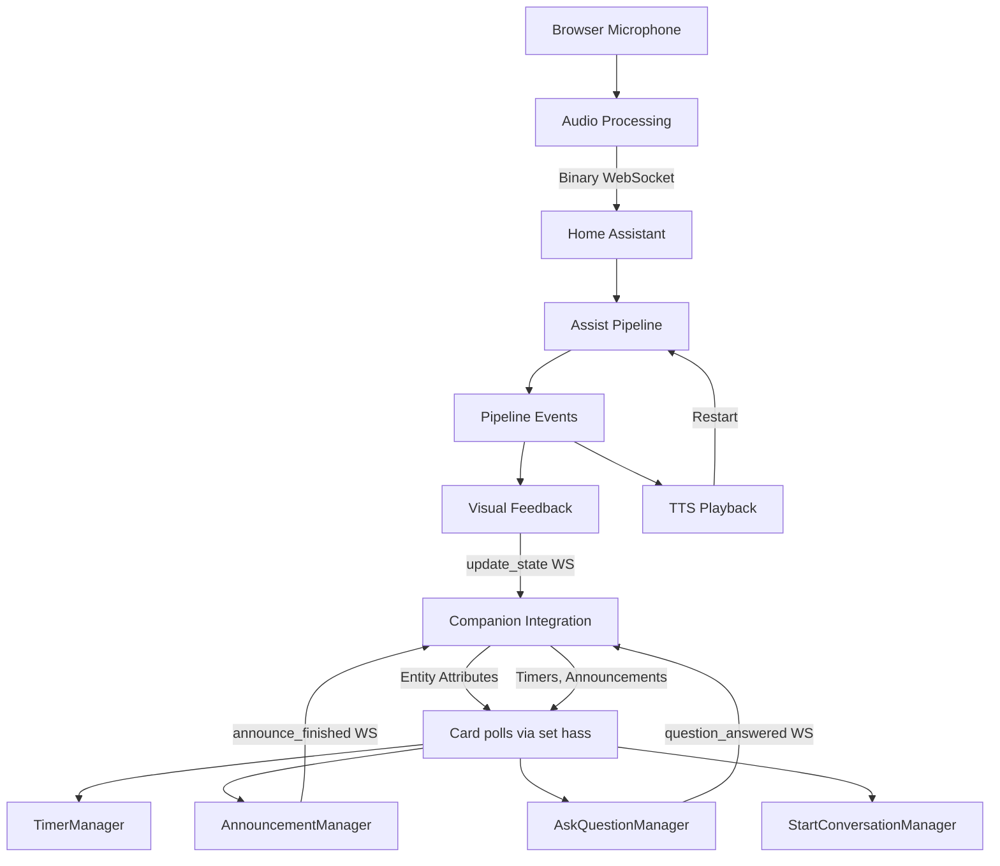
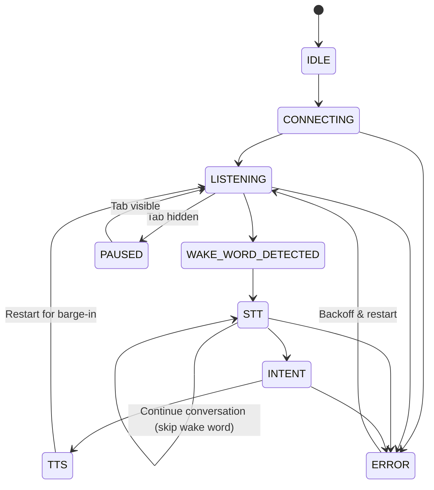

# Voice Satellite Card — Design Document

## 1. Overview

Voice Satellite Card is a custom Home Assistant Lovelace card that turns any browser into a voice-activated satellite. It captures microphone audio, sends it to Home Assistant's Assist pipeline over WebSocket, and plays back TTS responses — all without leaving the HA dashboard.

The source is organized as ES6 modules in `src/`, bundled via Webpack + Babel into a single `voice-satellite-card.min.js` for deployment. The card is invisible (returns `getCardSize() = 0`). All visual feedback is rendered via a global overlay appended to `document.body`, outside HA's Shadow DOM, so it persists across dashboard view changes.

---

## 2. High-Level Flow



1. The card acquires the browser microphone via `getUserMedia`.
2. Audio is captured via AudioWorklet (or ScriptProcessor fallback), resampled to 16 kHz mono PCM, and sent as binary WebSocket frames every 100 ms.
3. Home Assistant's `assist_pipeline/run` subscription routes the audio through wake word detection → speech-to-text → intent processing → text-to-speech.
4. The card receives pipeline events, updates visual feedback (gradient bar, transcription/response bubbles), and plays the TTS audio via an `<audio>` element.
5. When TTS begins playing, the pipeline is immediately restarted so it listens for the next wake word while audio plays (barge-in support). If the conversation agent signals `continue_conversation`, the card skips the wake word stage and restarts in STT mode for multi-turn dialogues.
6. The cycle repeats indefinitely.
7. When the optional **[companion integration](https://github.com/jxlarrea/voice-satellite-card-integration)** is configured, the card also polls entity attributes for timer and announcement state changes, syncs its pipeline state back to the integration entity via WebSocket, and sends announcement playback ACKs.

---

## 3. Architecture

### 3.1 Module Structure

The codebase follows a **folder-per-feature** convention. Each feature folder has an `index.js` (the manager class) and helper files for events, comms, and UI. Shared utilities live in `shared/`.

```
voice-satellite-card/
├── src/
│   ├── index.js                          ← Entry point, custom element registration
│   ├── constants.js                      ← State enum, DEFAULT_CONFIG, Timing, BlurReason, EXPECTED_ERRORS
│   ├── logger.js                         ← Shared Logger class
│   ├── styles.css                        ← CSS styles (imported as raw string via webpack)
│   │
│   ├── card/                             ← Main card class + helpers
│   │   ├── index.js                      ← VoiceSatelliteCard (thin orchestrator)
│   │   ├── events.js                     ← State transitions, pipeline dispatch, TTS completion
│   │   ├── comms.js                      ← Satellite state sync, interaction state, wake word switch
│   │   ├── ui.js                         ← UIManager (overlay, bar, blur, start button, chat DOM)
│   │   ├── chat.js                       ← ChatManager (bubbles, streaming fade)
│   │   ├── double-tap.js                 ← DoubleTapHandler (cancel with touch dedup)
│   │   └── visibility.js                 ← VisibilityManager (tab pause/resume)
│   │
│   ├── audio/                            ← Audio capture + chimes + media playback
│   │   ├── index.js                      ← AudioManager (mic, worklet, send interval)
│   │   ├── processing.js                 ← AudioWorklet/ScriptProcessor setup, resample, buffer
│   │   ├── comms.js                      ← Binary WebSocket audio transmission
│   │   ├── chime.js                      ← Web Audio API chime generation (all chime patterns)
│   │   └── media-playback.js             ← HTML Audio element playback + URL normalization
│   │
│   ├── tts/                              ← TTS playback orchestration
│   │   ├── index.js                      ← TtsManager (browser/remote, streaming, chime facade)
│   │   └── comms.js                      ← Remote media_player service calls
│   │
│   ├── pipeline/                         ← Assist pipeline lifecycle
│   │   ├── index.js                      ← PipelineManager (start/stop/restart, idle timeout, retry)
│   │   ├── events.js                     ← Pipeline event handlers (run-start through error)
│   │   └── comms.js                      ← Pipeline WS calls (subscribe, device ID, reconnect)
│   │
│   ├── timer/                            ← Timer countdown + alerts
│   │   ├── index.js                      ← TimerManager (timer state, alert lifecycle)
│   │   ├── events.js                     ← State change processing, dedup
│   │   ├── ui.js                         ← Timer pills, alert overlay, countdown tick
│   │   └── comms.js                      ← Timer cancel via conversation.process
│   │
│   ├── announcement/                     ← Simple announcements
│   │   └── index.js                      ← AnnouncementManager (chime → media → ACK → clear)
│   │
│   ├── ask-question/                     ← Ask question (STT capture + match feedback)
│   │   ├── index.js                      ← AskQuestionManager (prompt → STT → answer → feedback)
│   │   └── comms.js                      ← question_answered WS command
│   │
│   ├── start-conversation/               ← Start conversation (prompt → STT listening mode)
│   │   └── index.js                      ← StartConversationManager (prompt → restartContinue)
│   │
│   ├── editor/                           ← Config editor + preview
│   │   ├── index.js                      ← getConfigForm() schema assembler
│   │   ├── bar.js                        ← Activity bar config section
│   │   ├── behavior.js                   ← Behavior, mic, timeouts section
│   │   ├── bubbles.js                    ← Transcription/response bubble section
│   │   ├── media.js                      ← Volume, chimes, announcements section
│   │   ├── timer.js                      ← Timer pill config section
│   │   └── preview.js                    ← Editor preview renderer
│   │
│   └── shared/                           ← Cross-cutting utilities
│       ├── singleton.js                  ← Single-instance guarantee (module-scoped via window)
│       ├── satellite-notification.js     ← Shared lifecycle for announcement/ask-question/start-conversation
│       ├── notification-comms.js         ← sendAck WS call (shared by all notification managers)
│       ├── entity-subscription.js        ← Entity state_changed subscription + reconnect pattern
│       ├── format.js                     ← Pure formatting (formatTime)
│       └── style-utils.js               ← Shared bubble/pill styling (applyBubbleStyle)
│
├── .github/
│   ├── workflows/
│   │   ├── release.yml                   ← Build + upload release assets on GitHub release
│   │   └── validate.yml                  ← HACS validation (push, PR, daily cron)
│   └── funding.yml                       ← Sponsor links (Buy Me a Coffee, GitHub Sponsors)
├── voice-satellite-card.min.js           ← Built output (minified, committed for HACS)
├── voice-satellite-card.js               ← Built output (readable, gitignored)
├── voice-satellite-card.js.map           ← Source map (gitignored)
├── package.json                          ← npm scripts: build, dev
├── package-lock.json                     ← npm lockfile (committed)
├── webpack.config.js                     ← Dual output (readable + minified)
├── babel.config.js                       ← ES6+ target (modern browsers)
├── hacs.json                             ← HACS metadata (name, filename, HA version)
├── LICENSE                               ← MIT License
├── .gitignore                            ← Ignores node_modules/, .js, .js.map (not .min.js)
├── README.md                             ← User-facing docs, badges, installation, configuration
├── DESIGN.md                             ← This file — architecture, implementation details
└── .vscode/
    ├── settings.json                     ← Editor config
    └── tasks.json                        ← Ctrl+Shift+B → npm run dev
```

### 3.2 Layering Rules

The codebase enforces strict layering:

**1. Comms files are pure.** Every `comms.js` takes `card` as its first parameter and only uses public accessors (`card.config`, `card.hass`, `card.logger`, `card.connection`). Comms files return promises and never mutate manager state. All WebSocket `sendMessagePromise`, `callService`, and `connection.socket.send` calls live in comms files.

**2. Helper files use public accessors.** Event handlers and UI helpers within a module (e.g. `pipeline/events.js`, `timer/ui.js`) access their manager via public getters/setters (e.g. `mgr.card`, `mgr.log`, `mgr.binaryHandlerId`), never `mgr._privateField`.

**3. Cross-module access uses the card.** Managers access each other through the card instance: `mgr.card.tts.isPlaying`, `mgr.card.ui.showBlurOverlay()`. No manager imports another manager directly.

**4. Audio operations live in `audio/`.** All `AudioContext`, oscillator, and `new Audio()` creation is in `audio/chime.js` and `audio/media-playback.js`. Other modules call these utilities via the card.

**5. DOM operations live in `card/ui.js`.** All `document.body` manipulation, overlay creation, and element styling is in `UIManager`. Exception: `card/double-tap.js` and `card/visibility.js` register `document` event listeners (not DOM manipulation).

**6. Formatting utilities live in `shared/`.** Pure functions like `formatTime()` and `applyBubbleStyle()` are in `shared/format.js` and `shared/style-utils.js`.

### 3.3 Build System

Webpack bundles all ES6 modules into a single file for HA custom card deployment. Babel transpiles only features unsupported by the last 2 versions of Chrome, Firefox, Safari, and Edge — native ES6+ (classes, arrow functions, async/await, const/let) passes through untranspiled for performance. CSS files are imported as raw strings via Webpack's `asset/source` type (no CSS extraction — the string is injected into the DOM at runtime by `UIManager`).

The version number is defined once in `package.json` and injected at build time via Webpack's `DefinePlugin` as `__VERSION__`, consumed by `constants.js`.

**npm scripts:**

- `npm run build` — produces both `voice-satellite-card.js` (readable, with source map) and `voice-satellite-card.min.js` (minified, no source map) in the repo root
- `npm run dev` — builds and copies the readable version + source map to HA (`\\hassio\config\www\`)

Only `voice-satellite-card.min.js` is committed to git. The readable version and source map are gitignored (local debugging only).

**VS Code integration:** `.vscode/tasks.json` maps **Ctrl+Shift+B** to `npm run dev` (default build task).

**GitHub infrastructure:**

- **Release workflow** (`.github/workflows/release.yml`): Triggers on GitHub release creation or manual `workflow_dispatch`. Checks out code, installs Node 20, runs `npm ci && npm run build`, then uploads `voice-satellite-card.min.js` as a release asset via `softprops/action-gh-release@v2`.
- **Funding** (`.github/funding.yml`): Configures the "Sponsor" button with `buy_me_a_coffee: jxlarrea` and `github: jxlarrea`.
- **HACS validation** (`.github/workflows/validate.yml`): Runs `hacs/action@main` with `category: plugin` on push, PR, daily cron, and manual dispatch. Only runs when `github.repository_owner == 'jxlarrea'`.
- **HACS metadata** (`hacs.json`): `{ "name": "Voice Satellite Card", "render_readme": true, "filename": "voice-satellite-card.min.js", "homeassistant": "2025.1.2" }`.
- **HACS compliance**: `voice-satellite-card.min.js` must remain committed to the default branch.

### 3.4 Constants (`src/constants.js`)

- `VERSION` — injected at build time via `__VERSION__` (Webpack DefinePlugin from `package.json` version)
- `State` — enum: IDLE, CONNECTING, LISTENING, PAUSED, WAKE_WORD_DETECTED, STT, INTENT, TTS, ERROR
- `INTERACTING_STATES` — array: [WAKE_WORD_DETECTED, STT, INTENT, TTS]
- `EXPECTED_ERRORS` — array: `timeout`, `wake-word-timeout`, `stt-no-text-recognized`, `duplicate_wake_up_detected` (note: underscores, not dashes — HA API inconsistency)
- `BlurReason` — enum: PIPELINE, TIMER, ANNOUNCEMENT
- `Timing` — all timing constants in milliseconds: DOUBLE_TAP_THRESHOLD (400), TIMER_CHIME_INTERVAL (3000), PILL_EXPIRE_ANIMATION (400), PLAYBACK_WATCHDOG (30000), RECONNECT_DELAY (2000), INTENT_ERROR_DISPLAY (3000), NO_MEDIA_DISPLAY (3000), ASK_QUESTION_CLEANUP (2000), MAX_RETRY_DELAY (30000), RETRY_BASE_DELAY (5000), VISIBILITY_DEBOUNCE (500), DISCONNECT_GRACE (100)
- `DEFAULT_CONFIG` — full default configuration object with all card options
- `seamlessGradient(colorList)` — takes a comma-separated color string, appends the first color to the end, returns a CSS `linear-gradient(90deg, ...)` string for seamless animation loops

### 3.5 Composition Pattern

The main `VoiceSatelliteCard` class (`card/index.js`) is a thin orchestrator. All functionality is delegated to manager instances created in the constructor:

| Manager | Property | Module | Responsibility |
|---------|----------|--------|---------------|
| `Logger` | `card.logger` | `logger.js` | Debug-gated console logging |
| `AudioManager` | `card.audio` | `audio/` | Mic capture, AudioWorklet/ScriptProcessor, resample, binary send |
| `TtsManager` | `card.tts` | `tts/` | Browser/remote TTS playback, chimes, streaming TTS |
| `PipelineManager` | `card.pipeline` | `pipeline/` | Pipeline lifecycle, event handling, idle timeout, error recovery |
| `UIManager` | `card.ui` | `card/ui.js` | Global overlay, activity bar, blur, start button |
| `ChatManager` | `card.chat` | `card/chat.js` | Chat bubbles, streaming fade |
| `DoubleTapHandler` | `card.doubleTap` | `card/double-tap.js` | Double-tap cancel with touch/click dedup |
| `VisibilityManager` | `card.visibility` | `card/visibility.js` | Tab visibility pause/resume |
| `TimerManager` | `card.timer` | `timer/` | Timer countdown pills, alert chimes, voice/tap cancel |
| `AnnouncementManager` | `card.announcement` | `announcement/` | TTS announcements with pre-chime, queue, ACK |
| `AskQuestionManager` | `card.askQuestion` | `ask-question/` | Ask question: prompt → STT → answer → match feedback |
| `StartConversationManager` | `card.startConversation` | `start-conversation/` | Start conversation: prompt → STT listening mode |

Each manager receives the card instance via its constructor. The card exposes public getters (`config`, `connection`, `hass`, `currentState`, `logger`, etc.) that managers and helpers read.

**Public accessor pattern:** The card and each manager expose public getters (and setters where mutation is needed) for all state used by helper files. For example, `PipelineManager` exposes `get/set binaryHandlerId`, `get/set shouldContinue`, `get/set serviceUnavailable`, etc. Helper files like `pipeline/events.js` use only these public accessors — never `mgr._privateField`.

**Callback pattern:** Managers that need to notify the card use explicit callback methods:

- `TtsManager._onComplete()` → `card.onTTSComplete(playbackFailed)` — playback finished
- `DoubleTapHandler` → `card.pipeline.restart()`, `card.chat.clear()` — cancel interaction
- `VisibilityManager` → `card.pipeline.restart()` — resume after tab switch

**Card delegation methods:** The card exposes thin methods that delegate to `card/events.js` and `card/comms.js`:
- `card.setState(state)` → `setState(card, state)` in events.js
- `card.onTTSComplete(playbackFailed)` → `onTTSComplete(card, playbackFailed)` in events.js
- `card.onStartClick()` → `handleStartClick(card)` in events.js
- `card.onPipelineMessage(message)` → `handlePipelineMessage(card, message)` in events.js
- `card.updateInteractionState(state)` → `updateInteractionState(card, state)` in comms.js
- `card.turnOffWakeWordSwitch()` → `turnOffWakeWordSwitch(card)` in comms.js

### 3.6 Card Lifecycle

**Registration (`index.js`):**

```javascript
customElements.define('voice-satellite-card', VoiceSatelliteCard);
window.customCards = window.customCards || [];
window.customCards.push({ type: 'voice-satellite-card', name: 'Voice Satellite Card', ... });
console.info('%c VOICE-SATELLITE-CARD %c v' + VERSION + ' ', ...);
```

**Constructor:** Creates all manager instances. Initial state is `IDLE`. The card renders a hidden Shadow DOM element.

**`set hass(hass)`:** Called by HA when connection is available. On the active claimed owner (`singleton.isActive() && singleton.isOwner(this)`), calls `update()` on all four notification managers (timer, announcement, ask-question, start-conversation). First call only (guarded by `_hasStarted`): stores connection, ensures global UI, then either starts listening or shows start button. **Critical:** The `isActive()` check prevents subscription spam — before `singleton.claim()` succeeds, `isOwner()` returns true for all cards (since `instance` is null), so `isActive()` gates subscriptions to only fire after a card has successfully started.

**`setConfig(config)`:** Merges user config with `DEFAULT_CONFIG`. Updates logger debug flag. Calls `ui.applyStyles()` if overlay exists. Propagates config to active instance via `singleton.propagateConfig()`.

**`connectedCallback()`:** Renders Shadow DOM, ensures global UI, sets up visibility handler. If no instance is active and hass is available, starts listening. Uses `requestAnimationFrame` to defer editor preview detection.

**`disconnectedCallback()`:** Uses `Timing.DISCONNECT_GRACE` (100ms) delay to distinguish view switches from real disconnects.

**`startListening()` sequence (card/events.js):**
1. Guards via singleton (`isActive`, `isStarting`)
2. Sets state to CONNECTING
3. `await audio.startMicrophone()`
4. `await pipeline.start()`
5. `singleton.claim(card)` — marks this instance as active
6. Hides start button, sets up double-tap handler
7. On failure: shows start button for mic errors, or retries with backoff for pipeline errors

**`handleStartClick()` (card/events.js):** Calls `audio.ensureAudioContextForGesture()` within user gesture, then `startListening()`.

### 3.7 Event Routing

`handlePipelineMessage()` in `card/events.js` is the central event dispatcher. It checks guards (`visibility.isPaused`, `pipeline.isRestarting`), then routes by `message.type`:

| Event | Handler |
|-------|---------|
| `run-start` | `pipeline.handleRunStart(eventData)` |
| `wake_word-start` | `pipeline.handleWakeWordStart()` |
| `wake_word-end` | `pipeline.handleWakeWordEnd(eventData)` |
| `stt-start` | `setState(card, State.STT)` |
| `stt-vad-start` / `stt-vad-end` | Log only |
| `stt-end` | `pipeline.handleSttEnd(eventData)` |
| `intent-start` | `setState(card, State.INTENT)` |
| `intent-progress` | `pipeline.handleIntentProgress(eventData)` (if `streaming_response` enabled) |
| `intent-end` | `pipeline.handleIntentEnd(eventData)` |
| `tts-start` | `setState(card, State.TTS)` |
| `tts-end` | `pipeline.handleTtsEnd(eventData)` |
| `run-end` | `pipeline.handleRunEnd()` |
| `error` | `pipeline.handleError(errorData)` |

### 3.8 TTS Complete Callback

`onTTSComplete(card, playbackFailed)` in `card/events.js`:

1. **Barge-in check:** If current state is WAKE_WORD_DETECTED, STT, or INTENT — skip cleanup. TTS excluded from guard.
2. **Continue conversation:** If `!playbackFailed` and `shouldContinue` and `continueConversationId` — keep UI, call `restartContinue(conversationId)`.
3. **Normal completion:** Done chime (browser only), clear chat, hide blur, update interaction state to IDLE, sync satellite state, then `playQueued()` on all three notification managers.

### 3.9 Satellite State Synchronization

Via `syncSatelliteState()` in `card/comms.js`. Sends `voice_satellite/update_state` WS command.

**State strings:** The card sends raw state strings (`IDLE`, `LISTENING`, `STT`, `INTENT`, `TTS`, etc.) directly. The integration maps them to HA satellite states (`idle`, `listening`, `processing`, `responding`) server-side.

**Dedup:** `card.lastSyncedSatelliteState` prevents redundant WS calls. **Barge-in guard:** Sync to IDLE/LISTENING suppressed while `tts.isPlaying`.

### 3.10 Response Text Extraction

`extractResponseText()` in `pipeline/events.js` — 4-level fallback: `speech.plain.speech` → `speech.speech` → `plain` → raw string.

### 3.11 Deferred Run-End

When `run-end` arrives while TTS is playing, `pendingRunEnd = true`. Resolved when `onTTSComplete()` handles cleanup. `finishRunEnd()` clears flag, clears chat, hides blur, sets state to IDLE, then restarts pipeline (unless `serviceUnavailable` is true, in which case retry is already scheduled).

---

## 4. State Machine



| State | Description |
|-------|-------------|
| `IDLE` | Not connected, waiting to start |
| `CONNECTING` | Acquiring microphone, subscribing to pipeline |
| `LISTENING` | Pipeline active, listening for wake word. No visible bar. |
| `PAUSED` | Tab hidden, microphone tracks disabled, audio send stopped |
| `WAKE_WORD_DETECTED` | Wake word heard. Bar visible. Blur overlay shown. |
| `STT` | Speech-to-text in progress. Bar continues "listening" animation. |
| `INTENT` | Processing user intent. Bar "processing" (fast) animation. |
| `TTS` | TTS audio playing. Bar "speaking" animation. |
| `ERROR` | Unexpected error. Red error bar. Retry with backoff. |

---

## 5. User Interface

### 5.1 Global UI Overlay

All UI elements inside `<div id="voice-satellite-ui">` appended to `document.body`. Required because HA destroys/recreates card elements on view switches.

```html
<div id="voice-satellite-ui">
  <div class="vs-blur-overlay"></div>
  <button class="vs-start-btn"><svg>...</svg></button>
  <div class="vs-chat-container"></div>
  <div class="vs-rainbow-bar"></div>
</div>
```

CSS injected once into `<head>` as `<style id="voice-satellite-styles">`. Z-index: blur=9999, bar=10000, button/chat=10001.

### 5.2 Pointer Events — Critical

Hidden overlay elements MUST have `pointer-events: none`. Switch to `pointer-events: auto` only with `.visible` class.

### 5.3 Blur Overlay

Full-screen backdrop with `backdrop-filter: blur()`. Always `pointer-events: none`.

**Reference counting:** `showBlurOverlay(reason)` / `hideBlurOverlay(reason)` — only hidden when all reasons cleared. Reasons: `BlurReason.PIPELINE`, `BlurReason.TIMER`, `BlurReason.ANNOUNCEMENT`.

### 5.4 Chat Container

Managed by `ChatManager` (`card/chat.js`). Flex column above gradient bar.

**Methods:** `addUser(text)`, `addAssistant(text)`, `updateResponse(text)` (streaming fade), `clear()`.

**Legacy wrappers:** `showTranscription(text)` → `addUser()`. `showResponse(text)` → sets `textContent` directly on `streamEl` (no fade).

**Streaming fade:** Last 24 chars wrapped in `<span>` with decreasing opacity. Final text via `textContent` (clean).

**Styling:** `applyBubbleStyle()` from `shared/style-utils.js` applies 9-property pattern (font size/family/color, bold, italic, background, border, padding, rounded).

### 5.5 Start Button

56×56px floating mic button. Shown on mic failure. `_pendingStartButtonReason` handles pre-overlay calls.

### 5.6 Key UIManager Methods

Beyond state management, `UIManager` provides methods used by the notification system:

- `showBarSpeaking()` — saves current bar visibility, shows bar with speaking animation. Returns previous visibility state.
- `restoreBar(wasVisible)` — restores bar to pre-notification state.
- `addChatMessage(text, type)` — adds a styled bubble (type: `'announcement'`). Used by notifications for message display.
- `clearAnnouncementBubbles()` — removes only announcement-type bubbles (not user/assistant chat).
- `showTimerAlert(onDismiss)` — shows full-screen timer alert overlay with dismiss callback.
- `flashErrorBar()` — shows red error bar, adds `error-flash` CSS class (3× blink animation), auto-removes on `animationend`.

---

## 6. Gradient Bar

### 6.1 Bar States

| State | Visible | Speed |
|-------|---------|-------|
| IDLE, CONNECTING, LISTENING, PAUSED | No | — |
| WAKE_WORD_DETECTED, STT | Yes | 3s |
| INTENT | Yes | 0.5s |
| TTS | Yes | 2s |
| ERROR | Yes | 2s, red |

### 6.2 Error Mode

Red gradient stays visible via `pipeline.serviceUnavailable`. Intent errors auto-hide after `Timing.INTENT_ERROR_DISPLAY` (3s).

### 6.3 TTS Bar Persistence

`ui.updateForState(state, serviceUnavailable, ttsPlaying)` — refuses to hide when `ttsPlaying` is true.

### 6.4 CSS

`background-size: 200% 100%` with `vs-gradient-flow` keyframes. `seamlessGradient()` appends first color for seamless loop.

---

## 7. Chimes

All chimes generated programmatically via Web Audio API oscillator in `audio/chime.js`. No audio files.

### 7.1 Chime Types

| Constant | Trigger | Notes |
|----------|---------|-------|
| `CHIME_WAKE` | `wake_word-end` (valid wake word) | Sine, C5→E5→G5 (523→659→784 Hz) ascending |
| `CHIME_DONE` | TTS playback complete | Sine, G5→E5 (784→659 Hz) descending |
| `CHIME_ERROR` | Unexpected pipeline/intent error | Square wave, 300→200 Hz |
| `CHIME_ANNOUNCE` | Pre-announcement ding-dong | Sine, G5→D5 (784→587 Hz) |
| `CHIME_ALERT` | Timer finished | Sine, A5→E5→A5 (880→660→880 Hz) three-tone repeating |

### 7.2 Volume

Scaled to max 0.5: `(config.chime_volume / 100) * 0.5`. Error chime additionally reduced to 30%.

### 7.3 Implementation

Two playback functions in `audio/chime.js`, selected by pattern `type`:

**`playChime(card, pattern, log)`** — for `type: 'single'` patterns (WAKE, DONE, ERROR). Creates one oscillator, schedules frequency steps via `setValueAtTime()`, uses exponential gain ramp envelope. Called by `TtsManager.playChime(type)` which maps string names ('wake', 'done', 'error') to pattern constants.

**`playMultiNoteChime(card, pattern, options)`** — for `type: 'multi'` patterns (ANNOUNCE, ALERT). Creates a separate oscillator per note with explicit `start`/`end` timing. Supports `onDone` callback (used by announcement pre-chime to chain into main media playback).

**`getOrCreateContext(card)`** — reuses AudioManager's existing `AudioContext` if available and not closed (resumes if suspended), otherwise creates a new one. Returns `{ ctx, owned }` so callers know whether to close it.

### 7.4 Configuration

`chime_on_wake_word` enables wake chime. `chime_on_request_sent` enables done chime. Error chime respects `chime_on_wake_word`. Chimes always play locally (browser), never routed to remote media players.

---

## 8. Error Handling

### 8.1 Expected Errors

Normal operational events — immediate restart, no error chime, no red bar:

| Code | Meaning |
|------|---------|
| `timeout` | Pipeline-level idle timeout (from HA server) |
| `wake-word-timeout` | Wake word detection timed out |
| `stt-no-text-recognized` | User spoke but no text recognized |
| `duplicate_wake_up_detected` | Wake word already being processed (underscores, not dashes) |

**Interaction-aware cleanup:** If user was mid-interaction (`INTERACTING_STATES`), transitions to IDLE, clears chat/blur, plays done chime before restarting.

### 8.2 Unexpected Errors

All other error codes: error chime (if interacting), red error bar, `serviceUnavailable = true`, retry with backoff.

### 8.3 Intent Errors

`intent-end` with `response_type: "error"` — red bar (auto-hides after 3s), error chime, `suppressTTS = true`.

### 8.4 Wake Word Service Unavailable

`wake_word-end` with empty `wake_word_output` — error bar, `serviceUnavailable = true`, backoff restart. Recovery mechanism: `handleWakeWordStart()` checks if `serviceUnavailable` is true. If so, starts a 2-second confirmation timer (`Timing.RECONNECT_DELAY`). If `serviceUnavailable` is still true when the timer fires, the service has recovered — clears error bar, resets retry count. This avoids false recovery on transient `wake_word-start` events.

### 8.5 Ask Question Error

If STT-only pipeline errors during ask-question, `handleError` checks `askQuestionCallback` — invokes with empty string, returns early.

---

## 9. Service Recovery & Retry

### 9.1 Retry Backoff

Linear: `Math.min(Timing.RETRY_BASE_DELAY * retryCount, Timing.MAX_RETRY_DELAY)` → 5s, 10s, ..., 30s cap. Reset on recovery.

### 9.2 Pipeline Idle Timeout

`pipeline_idle_timeout` (default 300s) restarts pipeline while idle to refresh TTS tokens. Defers if mid-interaction or TTS playing.

### 9.3 Pipeline Response Timeout

`pipeline_timeout` (default 60s) sent to HA as run config `timeout`. Per-run, distinct from idle timeout.

### 9.4 Tab Visibility

**Hidden:** `isPaused` set immediately (blocks events), interaction UI cleaned up, then after `Timing.VISIBILITY_DEBOUNCE` (500ms) audio paused → PAUSED.

**Visible:** `audio.resume()`, pipeline state reset (`pipeline.resetForResume()`), `pipeline.restart(0)` — always fresh start.

### 9.5 Concurrent Restart Prevention

`pipeline.isRestarting` flag serializes concurrent restart attempts. Set at `restart()` entry, cleared before `start()`. `handleRunEnd()` also checks and skips.

### 9.6 Home Assistant Reconnection

On `'ready'` event:

**PipelineManager:** `setupReconnectListener()` in `pipeline/comms.js` → `resetRetryState()`, clear error bar, restart after `Timing.RECONNECT_DELAY` (2s).

**Notification Managers:** `entity-subscription.js` re-subscribes to `state_changed` with singleton guard (`card.isOwner`).

---

## 10. WebSocket Communication

### 10.1 Connection

Uses HA's existing `hass.connection`. Binary audio via `hass.connection.socket`. Card's `connection` getter falls back to `_hass.connection` if `_connection` is null.

### 10.2 Pipeline Subscription

`subscribePipelineRun()` in `pipeline/comms.js`:

```javascript
connection.subscribeMessage(onMessage, {
  type: 'assist_pipeline/run',
  start_stage: 'wake_word',  // or 'stt' for continue conversation
  end_stage: 'tts',          // or 'stt' for ask-question
  input: { sample_rate: 16000, timeout: 0 },
  pipeline: pipelineId,
  timeout: config.pipeline_timeout,
  device_id: deviceId,       // resolved from satellite_entity for timer support
});
```

**`input.timeout: 0` is critical.** Omitted → HA defaults to 3s → `wake-word-timeout` errors. `timeout: 0` = listen indefinitely. Omitted for STT start stage (server VAD handles silence).

**`device_id` resolution:** `resolveDeviceId()` in `pipeline/comms.js` looks up the satellite entity's `device_id` via HA's entity registry. Required for timer support — without it, HA cannot route timer events to the correct device.

**Post-subscription:** After `subscribePipelineRun()` returns, `pipeline.start()` calls `audio.startSending(() => this._binaryHandlerId)` to begin sending mic audio, sets `_isStreaming = true`, and starts the idle timeout. The `subscribePipelineRun` callback routes events to `card.onPipelineMessage(message)`.

### 10.3 Pipeline Event Format

**Events delivered DIRECTLY — NOT wrapped in `{ type: "event", event: {...} }`.**

```javascript
{ type: "run-start", data: { runner_data: { stt_binary_handler_id: 1 } }, timestamp: "..." }
```

Read `message.type` and `message.data` directly. Do NOT access `message.event`.

### 10.4 Pipeline Events Reference

| Event | Key Data Fields |
|-------|----------------|
| `run-start` | `data.runner_data.stt_binary_handler_id`; optionally `data.tts_output.url` + `stream_response: true` |
| `wake_word-end` | `data.wake_word_output.wake_word_id` (empty object = service unavailable) |
| `stt-end` | `data.stt_output.text` |
| `intent-progress` | `data.chat_log_delta.content` (text); `data.tts_start_streaming: true` (early TTS) |
| `intent-end` | `data.intent_output.response.speech.plain.speech`; `response_type`; `continue_conversation`; `conversation_id` |
| `tts-end` | `data.tts_output.url` or `data.tts_output.url_path` |
| `error` | `data.code`, `data.message` |

### 10.5 Binary Audio Transmission

`sendBinaryAudio()` in `audio/comms.js`. First byte = `stt_binary_handler_id`, then 16-bit PCM. Checks `socket.readyState === WebSocket.OPEN`.

### 10.6 Comms Files Summary

| File | Functions |
|------|-----------|
| `card/comms.js` | `syncSatelliteState`, `updateInteractionState`, `turnOffWakeWordSwitch` |
| `pipeline/comms.js` | `resolveDeviceId`, `listPipelines`, `subscribePipelineRun`, `setupReconnectListener` |
| `audio/comms.js` | `sendBinaryAudio` |
| `tts/comms.js` | `playRemote`, `stopRemote` |
| `timer/comms.js` | `sendCancelTimer` |
| `ask-question/comms.js` | `sendAnswer` |
| `shared/notification-comms.js` | `sendAck` |

Every comms function takes `card` as first parameter, uses only public accessors.

---

## 11. Microphone

### 11.1 Audio Capture Chain

```
getUserMedia → MediaStreamSource → AudioWorklet (or ScriptProcessor) → Float32 buffer → resample → Int16 PCM → binary WebSocket
```

Setup in `audio/processing.js` (worklet/processor creation, resample, PCM conversion). Buffer management and send interval in `audio/index.js`. Binary WebSocket transmission in `audio/comms.js`. The flow per 100ms tick: `audio/index.js` calls `sendAudioBuffer()` in `processing.js`, which combines buffers, resamples, converts to PCM, then calls `sendBinaryAudio()` in `comms.js`.

### 11.2 Audio Format

| Parameter | Value |
|-----------|-------|
| Sample Rate | 16,000 Hz (resampled if browser provides different rate) |
| Channels | 1 (mono) |
| Bit Depth | 16-bit signed PCM |
| Chunk Size | 2048 samples per ScriptProcessor, 128 per AudioWorklet frame |
| Send Interval | 100ms |

### 11.3 Audio Constraints

```javascript
{
  sampleRate: 16000,
  channelCount: 1,
  echoCancellation: config.echo_cancellation,
  noiseSuppression: config.noise_suppression,
  autoGainControl: config.auto_gain_control,
  // Chrome-only voice isolation via advanced constraints
  advanced: config.voice_isolation ? [{ voiceIsolation: true }] : undefined
}
```

### 11.4 AudioWorklet

Preferred capture method. Inline processor created as Blob URL in `audio/processing.js`. Falls back to ScriptProcessor if unavailable.

### 11.5 Resampling

Linear interpolation in `audio/processing.js` when browser sample rate ≠ 16 kHz.

### 11.6 PCM Conversion

Float32 (-1.0 to +1.0) to Int16: `sample < 0 ? sample * 0x8000 : sample * 0x7FFF`.

### 11.7 Send Interval

`audio.startSending(binaryHandlerIdGetter)` starts a 100ms interval calling `sendAudioBuffer()` in `audio/processing.js`. The getter function (not a static value) allows `binaryHandlerId` to change across pipeline restarts. `audio.stopSending()` clears the interval. `audio.isStreaming` returns `true` when the interval is active.

`sendAudioBuffer()` combines buffered Float32 chunks, resamples if needed, converts to Int16 PCM, then calls `sendBinaryAudio()` in `audio/comms.js` for WebSocket transmission.

### 11.8 Pause/Resume

`audio.pause()` disables all audio tracks and stops the send interval. `audio.resume()` re-enables tracks. On visibility resume, if the pipeline is streaming but audio is not, `startSending()` is restarted with a fresh getter.

---

## 12. Browser Microphone Restrictions

### 12.1 The Problem

1. **HTTPS Required:** `getUserMedia` only works in secure contexts.
2. **User Gesture Required:** First call must occur within a user-initiated event.

### 12.2 The Solution

When `startListening()` fails with mic permission errors, the start button appears. The click handler provides the required user gesture via `audio.ensureAudioContextForGesture()`.

### 12.3 AudioContext Suspension

Mobile browsers create `AudioContext` in `suspended` state. The card calls `audioContext.resume()` inside `audio._ensureAudioContextRunning()`.

### 12.4 Fully Kiosk Browser Exception

Does NOT have the user gesture restriction when properly configured — auto-starts without interaction.

---

## 13. Singleton Instance Coordination

### 13.1 Singleton Module (`shared/singleton.js`)

Module-scoped state via `window.__vsSingleton` (shared across bundle loads):

| Function | Purpose |
|----------|---------|
| `isOwner(card)` | Whether the given card is (or can be) the owner |
| `getInstance()` | The current active card instance |
| `isActive()` | Whether any instance is active |
| `isStarting()` | Whether a startup is in progress |
| `setStarting(val)` | Mark startup in progress |
| `claim(card)` | Claim ownership after successful start |
| `propagateConfig(card)` | Forward config changes to active instance |

### 13.2 Notification Dedup

Module-scoped variables (not window globals):

| Variable | Location | Purpose |
|----------|----------|---------|
| `_lastAnnounceId` | `shared/satellite-notification.js` | Monotonic ID — first manager to claim wins |
| `_lastTimerJson` | `timer/events.js` | JSON string comparison prevents re-processing |

### 13.3 Entity Subscription Pattern

`shared/entity-subscription.js` provides `subscribeToEntity()` — subscribes to `state_changed` events, immediate state check, reconnect listener. The three notification managers (announcement, ask-question, start-conversation) use it via `shared/satellite-notification.js`. **TimerManager uses `entity-subscription.js` directly** because timers have their own processing and dedup logic separate from the notification lifecycle.

---

## 14. Configuration Reference

### Behavior

| Key | Type | Default | Description |
|-----|------|---------|-------------|
| `start_listening_on_load` | boolean | `true` | Auto-start on page load |
| `pipeline_id` | string | `''` | Pipeline ID (empty = preferred/first) |
| `wake_word_switch` | string | `''` | Entity to turn OFF on wake word |
| `state_entity` | string | `''` | `input_text` entity to track interaction state |
| `satellite_entity` | string | `''` | `assist_satellite` entity from companion integration |
| `pipeline_timeout` | number | `60` | Server-side: max seconds per pipeline run |
| `pipeline_idle_timeout` | number | `300` | Client-side: seconds before silent pipeline restart |
| `continue_conversation` | boolean | `true` | Multi-turn dialogue support |
| `double_tap_cancel` | boolean | `true` | Double-tap to cancel interaction |
| `chime_on_wake_word` | boolean | `true` | Play wake chime |
| `chime_on_request_sent` | boolean | `true` | Play done chime after TTS |
| `chime_volume` | number | `100` | Chime volume 0-100 |
| `tts_volume` | number | `100` | TTS playback volume 0-100 (browser only) |
| `tts_target` | string | `''` | TTS output: empty = browser, or `media_player.*` |
| `streaming_response` | boolean | `true` | Stream response text progressively |
| `debug` | boolean | `false` | Structured console logging |

### Microphone

| Key | Type | Default |
|-----|------|---------|
| `noise_suppression` | boolean | `true` |
| `echo_cancellation` | boolean | `true` |
| `auto_gain_control` | boolean | `true` |
| `voice_isolation` | boolean | `false` |

### Activity Bar

`bar_position` (bottom/top), `bar_height` (2-40, default 16), `bar_gradient` (rainbow), `background_blur` (true), `background_blur_intensity` (0-20, default 5).

### Bubble Styling

9-property pattern via `shared/style-utils.js`: `show_*`, `*_font_size` (20), `*_font_family` ('inherit'), `*_font_color`, `*_font_bold` (true), `*_font_italic` (false), `*_background`, `*_border_color`, `*_padding` (16), `*_rounded` (true). Applied to transcription (`transcription_*`), response (`response_*`), and timer (`timer_*`) prefixes.

### Timer

| Key | Type | Default | Description |
|-----|------|---------|-------------|
| `timer_position` | string | `'bottom-right'` | Pill position: `top-left`, `top-right`, `bottom-left`, `bottom-right` |
| `timer_finished_duration` | number | `60` | Seconds to show finished alert (0 = manual dismiss only) |

### Announcements

| Key | Type | Default | Description |
|-----|------|---------|-------------|
| `announcement_display_duration` | number | `5` | Seconds to display announcement bubble after playback |

---

## 15. TTS Playback

### 15.1 URL Construction

`buildMediaUrl()` in `audio/media-playback.js`. Relative paths prefixed with `window.location.origin`. Absolute URLs pass through.

### 15.2 Browser Playback (Default)

`playMediaUrl()` in `audio/media-playback.js` creates HTML `Audio` element.

**Barge-in restart:** In `handleTtsEnd()` (`pipeline/events.js`), after calling `tts.play(url)`, `pipeline.restart(0)` is called immediately in the same handler. This starts a new pipeline subscription that listens for the next wake word while TTS audio plays in the background.

**Watchdog:** `Timing.PLAYBACK_WATCHDOG` (30s) forces `_onComplete()` if no audio events fire. Cleared on normal completion, error, or `stop()`.

**Autoplay failure:** `_onComplete(true)` with `playbackFailed` flag when `play()` rejects, causing `onTTSComplete` to skip continue-conversation.

### 15.3 Streaming TTS

1. `run-start` provides URL with `stream_response: true` → `tts.storeStreamingUrl()`
2. `intent-progress` with `tts_start_streaming: true` → immediate `tts.play(tts.streamingUrl)`
3. `tts-end` → sees `tts.isPlaying` already true, skips duplicate playback

**Critical:** No pipeline restart at `tts_start_streaming` — text chunks still arriving.

### 15.3.1 Streaming Text Flow

Separate from streaming TTS audio. When `streaming_response` is enabled:

1. `intent-progress` events carry `chat_log_delta.content` text chunks
2. First chunk `{ chat_log_delta: { role: "assistant" } }` is skipped (no `content` string)
3. `handleIntentProgress()` appends each chunk to `chat.streamedResponse` accumulator
4. `chat.updateResponse(text)` renders with streaming fade effect (last 24 chars faded)
5. `handleIntentEnd()` calls `chat.showResponse(finalText)` (sets clean `textContent`), then resets `chat.streamedResponse = ''` and `chat.streamEl = null`

The `streamEl` property holds the current assistant message DOM element — created on first chunk, reused for subsequent chunks, cleared on intent-end and continue-conversation transitions.

### 15.4 Remote Playback

`playRemote()` in `tts/comms.js` calls `media_player.play_media`. UI hidden after `REMOTE_COMPLETION_DELAY` (2s). Done chime skipped. Barge-in calls `stopRemote()`.

### 15.5 The `tts.isPlaying` Flag

Tracks TTS activity regardless of target. Used by `ui.updateForState()`, `handleRunEnd()`, `handleWakeWordEnd()`, idle timeout.

### 15.6 `tts.stop()`

Sets `_playing = false`. Clears watchdog and end timer. Browser: nulls `onended`/`onerror` (ghost prevention), pauses, clears src. Remote: calls `stopRemote()`.

---

## 16. Continue Conversation

### 16.1 Flow

1. `handleIntentEnd()` stores `shouldContinue = true` and `continueConversationId`
2. `onTTSComplete()` checks → clears state, resets `chat.streamEl`, calls `restartContinue(conversationId)`
3. `restartContinue()` stops pipeline, sets `continueMode = true`, starts with `start_stage: 'stt'` + `conversation_id`
4. `handleRunStart()` checks `continueMode` → sets state to STT instead of LISTENING

### 16.2 Cleanup

Continue state cleared in all paths: barge-in, expected errors, tab hidden, `restartContinue()` failure.

---

## 17. Double-Tap to Cancel

`DoubleTapHandler` (`card/double-tap.js`) — `touchstart` and `click` on `document`. Two taps within `Timing.DOUBLE_TAP_THRESHOLD` (400ms). Touch/click dedup via `_lastTapWasTouch`.

**Actions:** Stop TTS → clear continue state → set IDLE → clear chat → hide blur → update interaction state → play done chime → restart pipeline.

**Timer alert:** Double-tap during alert → dismisses (checked before interaction cancel).

---

## 18. Interaction State Tracking

`state_entity` → `input_text` entity: `ACTIVE` on wake word, `IDLE` on TTS complete or cancel. Stays `ACTIVE` during multi-turn. Managed by `updateInteractionState()` in `card/comms.js`.

---

## 19. Structured Logging

`Logger` class. Format: `[VS][category] message`. `logger.log()` checks `_debug` internally. `logger.error()` always logs.

Categories: `state`, `lifecycle`, `mic`, `pipeline`, `event`, `error`, `recovery`, `tts`, `ui`, `switch`, `visibility`, `editor`, `timer`, `announce`, `ask-question`, `start-conversation`.

---

## 20. Visual Editor

### 20.1 Schema-Based Editor

`editor/index.js` assembles schema from section files (`bar.js`, `behavior.js`, `bubbles.js`, `media.js`, `timer.js`). HA renders using native selectors.

**Top-level fields:** `pipeline_id`, `satellite_entity`, `state_entity`, `wake_word_switch`, `continue_conversation`, `debug`.

**Hidden (YAML-only):** `start_listening_on_load`, `double_tap_cancel`.

**Expandable sections:** Volume & Chimes, Microphone Processing, Timeouts, Activity Bar, Transcription Bubble, Response Bubble, Timer Pill (requires integration), Announcements (requires integration).

### 20.2 Editor Preview

`editor/preview.js` — `isEditorPreview()` walks DOM for `hui-card-preview`. Renders 300px preview with bar, blur, checkered background, sample bubbles, timer pill preview. Updates live on config changes.

---

## 21. Companion Integration

### 21.1 Communication

**Card → Integration (WebSocket):**

| Command | Purpose |
|---------|---------|
| `voice_satellite/announce_finished` | ACK announcement playback |
| `voice_satellite/question_answered` | Submit answer (returns match result) |
| `voice_satellite/update_state` | Sync pipeline state |

**Integration → Card (Entity attributes):**

| Attribute | Type | Purpose |
|-----------|------|---------|
| `active_timers` | `list[dict]` | Timers: id, name, total_seconds, started_at |
| `last_timer_event` | `string` | Event type: started, cancelled, finished |
| `announcement` | `dict` | Pending notification (announcement/ask-question/start-conversation) |

### 21.2 Wake Word Switch

`turnOffWakeWordSwitch()` in `card/comms.js` — calls `homeassistant.turn_off` service (works with any toggleable entity: `switch`, `input_boolean`, `light`, etc.). Triggered on: wake word detected, announcement received, timer alert.

---

## 22. Notification System

### 22.1 Shared Lifecycle (`shared/satellite-notification.js`)

All three notification features share a common lifecycle:

1. **Subscribe** to `state_changed` events via `entity-subscription.js`
2. **Process** with dedup (`_lastAnnounceId`) and pipeline-busy queuing
3. **Claim** the notification ID so other managers skip it
4. **Play** notification: blur → bar → preannounce chime/media → main media → message bubble → onComplete
5. **ACK** via `sendAck()` in `notification-comms.js`
6. **Clear** UI via `clearNotificationUI()`

State fields initialized by `initNotificationState(mgr)` as public properties directly on the manager instance: `playing`, `currentAudio`, `clearTimeoutId`, `barWasVisible`, `queued`. Subscription state (`_subscribed`, `_unsubscribe`, `_entityId`, `_reconnectListener`) is managed by `entity-subscription.js` using underscore-prefixed properties set directly on the manager.

All notification managers expose `get card()` and `get log()` getters so that `satellite-notification.js` and `entity-subscription.js` can access the card and logger via public accessors.

**Critical:** `satellite-notification.subscribe()` checks `mgr._subscribed` (the property set by `entity-subscription.js`), NOT a separate public `subscribed` field. This ensures the dedup guard uses the same property that `subscribeToEntity()` sets to `true` and `unsubscribeEntity()` resets to `false`.

### 22.2 Announcements (`announcement/index.js`)

After playback + ACK: auto-clears after `announcement_display_duration` seconds (default 5).

### 22.3 Ask Question (`ask-question/index.js`)

After playback + ACK:
1. Wake chime (browser only)
2. STT-only mode via `pipeline.restartContinue(null, { end_stage: 'stt', onSttEnd: callback })`
3. Question bubble stays visible during STT
4. `sendAnswer()` in `ask-question/comms.js` → `voice_satellite/question_answered` → `{ success, matched, id }`
5. Done chime on match, error chime + `flashErrorBar()` on no match
6. 2s cleanup timer (immediate, not after WS round-trip)
7. `askQuestionHandled` flag prevents `handleRunEnd` UI cleanup

### 22.4 Start Conversation (`start-conversation/index.js`)

After playback + ACK: clears announcement UI, shows pipeline blur, `pipeline.restartContinue(null)` for full pipeline (STT → Intent → TTS).

### 22.5 Pipeline Busy Queuing

Notifications stored in `queued` when interaction active. `onTTSComplete()` calls `playQueued()` on all three managers.

---

## 23. Timers

### 23.1 Entity Contract

`active_timers`: list of `{ id, name, total_seconds, started_at, start_hours, start_minutes, start_seconds }`. `last_timer_event`: string.

### 23.2 Client Side

**TimerManager** (`timer/index.js`) subscribes via `entity-subscription.js`.

**State processing** (`timer/events.js`): Dedup via `_lastTimerJson`. Detects finished timers by diffing `knownTimerIds`.

**Timer pills** (`timer/ui.js`): Positioned pills, multiple stack, updated every second. Format: `HH:MM:SS` via `shared/format.js`.

**Timer alert** (`timer/ui.js`): Full-screen overlay, repeating `CHIME_ALERT` at `Timing.TIMER_CHIME_INTERVAL` (3s), blur `BlurReason.TIMER`, wake switch off. Auto-dismiss after `timer_finished_duration` (0 = manual only).

**Timer cancel** (`timer/comms.js`): `sendCancelTimer(card, timerName)` via `conversation.process` with built-in HA agent. Visual removal is optimistic.

---

## 24. Implementation Checklist

When recreating or modifying this card, verify:

**Architecture:**
- [ ] All comms files take `card` as first parameter, use only public accessors
- [ ] Helper files (events.js, ui.js, processing.js) use public getters/setters, never `mgr._field`
- [ ] All WebSocket/service calls isolated in comms files
- [ ] All audio creation (AudioContext, Audio, oscillators) in `audio/` module
- [ ] All DOM manipulation in `card/ui.js`
- [ ] Imports to folder modules use bare paths (`'../audio'` not `'../audio/index.js'`)

**Pipeline:**
- [ ] Messages read `message.type` / `message.data` directly (NOT `message.event`)
- [ ] `input.timeout: 0` for wake word, omitted for STT
- [ ] Streaming reads `chat_log_delta.content`, first chunk `{ role: "assistant" }` skipped
- [ ] `isRestarting` flag prevents concurrent restarts
- [ ] `restart()` clears idle timeout at entry, awaits `stop()` before new subscription
- [ ] `handleRunEnd()` checks `isRestarting` and `askQuestionHandled`
- [ ] `resetRetryState()` encapsulates 4-field retry reset
- [ ] Reconnect: `resetRetryState()` then restart after `Timing.RECONNECT_DELAY`
- [ ] Error logging: `(e?.message || JSON.stringify(e))`

**TTS:**
- [ ] `handleTtsEnd()` calls `tts.play()` then `pipeline.restart(0)` for barge-in
- [ ] `updateForState()` keeps bar visible while `tts.isPlaying`
- [ ] Done chime in `onTTSComplete()`, not `handleIntentEnd()`
- [ ] Done chime suppressed during barge-in, continue conversation, remote TTS
- [ ] `stop()` nulls `onended`/`onerror` before pausing
- [ ] Watchdog (30s) forces completion if no audio events
- [ ] `_onComplete(true)` on `play()` reject, skips continue-conversation
- [ ] Barge-in guard excludes `State.TTS`
- [ ] `streamingUrl` reset on every `run-start`
- [ ] No restart at `tts_start_streaming` (text still streaming)
- [ ] `handleTtsEnd()` skips if `isPlaying` already true
- [ ] `isPlaying` flag for all TTS checks (not `_currentAudio`)

**UI:**
- [ ] Hidden elements have `pointer-events: none`
- [ ] Chat container: `display: none` default, `flex` when `.visible`
- [ ] Chat positioned with `bottom`, not `top`
- [ ] `chat.streamEl` cleared between turns
- [ ] `chat.clear()` resets `streamedResponse`
- [ ] `chat._escapeHtml()` for streaming fade innerHTML
- [ ] Blur uses reference counting with reason strings

**Singleton:**
- [ ] `window.__vsSingleton` for cross-bundle state
- [ ] `disconnectedCallback` 100ms delay for view switch detection
- [ ] `_lastAnnounceId` and `_lastTimerJson` are module-scoped (not window)

**Timers:**
- [ ] Subscribe via `entity-subscription.js`, not polling
- [ ] `formatTime()` from `shared/format.js`
- [ ] Cancel via `sendCancelTimer()` using `conversation.process`
- [ ] `timer_finished_duration: 0` = manual dismiss only

**Notifications:**
- [ ] All three managers use `satellite-notification.js` lifecycle
- [ ] ACK via `sendAck()` in `notification-comms.js` (takes `card`)
- [ ] Queue behind active pipeline, `playQueued()` on all three managers
- [ ] Ask-question `askQuestionHandled` prevents `handleRunEnd` cleanup
- [ ] Ask-question cleanup starts immediately (2s, not after WS)
- [ ] Start-conversation clears UI before entering STT mode

**Browser:**
- [ ] `voice_isolation` uses `advanced` constraint array
- [ ] `audio/comms.js` checks `socket.readyState === OPEN`
- [ ] `duplicate_wake_up_detected` uses underscores
- [ ] `startListening()` retries pipeline errors, start button only for mic errors
- [ ] Tab hidden sets `isPaused` immediately before debounce
- [ ] Visibility resume resets pipeline via `resetForResume()` before restart
- [ ] Double-tap deduplicates `touchstart`/`click` via `_lastTapWasTouch`
- [ ] Double-tap sets IDLE before clearing UI
- [ ] `state_entity` updates only on WAKE_WORD_DETECTED (ACTIVE) and completion/cancel (IDLE)
- [ ] `state_entity` stays ACTIVE during continue conversation
- [ ] `onTTSComplete()` calls `playQueued()` on all three notification managers after cleanup

