#  Voice Satellite Card for Home Assistant

Transform any browser into a voice-activated satellite for Home Assistant's Assist. This custom card captures microphone audio and streams it to your Assist pipeline for wake word detection, speech recognition, and voice responses - turning tablets, wall-mounted displays, or any device with a microphone into a hands-free voice assistant.

[](https://my.home-assistant.io/redirect/hacs_repository/?owner=jxlarrea&repository=Voice-Satellite-Card-for-Home-Assistant)
[](https://github.com/jxlarrea/Voice-Satellite-Card-for-Home-Assistant/releases)
[](https://github.com/jxlarrea/Voice-Satellite-Card-for-Home-Assistant/releases)
[](https://github.com/jxlarrea/Voice-Satellite-Card-for-Home-Assistant/actions/workflows/release.yml)

[](https://buymeacoffee.com/jxlarrea)


## Why This Card?

Home Assistant's built-in voice features require dedicated hardware like ESPHome devices or specific voice assistant hardware. But what if you already have a tablet mounted on your wall running the Home Assistant dashboard?

**Voice Satellite Card** solves this by:

- **Using your browser's microphone** - No additional hardware needed.
- **Supporting wake words** - Say "OK Nabu" or your custom wake word to activate.
- **Playing TTS responses** - Hear responses directly from your device or a remote media player.
- **Working on any device** - Tablets, phones, computers, kiosks.
- **Providing visual feedback** - Gradient bar shows current state.
- **Showing transcriptions** - See what was understood on screen.

Perfect for wall-mounted tablets, kiosk displays, or any browser-based Home Assistant setup.

https://github.com/user-attachments/assets/50f51ebc-be70-4ea2-a1b5-8d80446f55c2

## Important: Browser Requirements

**Warning:** This card requires microphone access and works best when:

1. **The browser has microphone permissions granted** - You will be prompted on first use.
2. **The page is served over HTTPS** - Required for microphone access in modern browsers.
3. **The screen stays on** - If the device screen turns off completely, the microphone will stop working. Use a screensaver instead of screen-off to keep the mic active.

For kiosk setups like [Fully Kiosk Browser](https://play.google.com/store/apps/details?id=de.ozerov.fully), make sure to enable microphone permissions and use the screensaver feature (not screen off) to keep the microphone active while dimming the display.

For the **Home Assistant Companion App**, enable **Autoplay videos** in Settings → Companion App → Other settings. Without this, the WebView will block TTS audio playback.

## How It Works

```mermaid
graph TD
    A[🎤 Browser Mic] -->|16kHz PCM| B[Home Assistant]
    B --> C[Wake Word Detection]
    C --> D[Speech-to-Text]
    D --> E[Conversation Agent]
    E --> F[Text-to-Speech]
    F -->|Audio URL| G[🔊 TTS Playback]
    G -->|Restart| C
```



## Features

- **Wake Word Detection** - Uses Home Assistant's already configured wake word detection (like Wyoming openWakeWord) for server-side processing.
- **Works Across Views** - Pipeline stays active when switching dashboard views.
- **Auto-Start** - Automatically begins listening on page load (with fallback button).
- **Visual Feedback** - Customizable gradient activity bar shows listening/processing/speaking states.
- **Transcription Display** - Shows what was understood in a styled bubble.
- **Continue Conversation** - When the assistant asks a follow-up question, the card automatically listens for a response without requiring the wake word again. Conversation history is displayed in a chat-style interface.
- **Timers** - Voice-activated timers with on-screen countdown pills, alert chimes, and cancel via double-tap or voice. Requires the [companion integration](https://github.com/jxlarrea/voice-satellite-card-integration).
- **Announcements** - Receive `assist_satellite.announce` service calls with pre-announcement chimes and TTS playback. Queues behind active conversations. Requires the [companion integration](https://github.com/jxlarrea/voice-satellite-card-integration).
- **Start Conversation** - Receive `assist_satellite.start_conversation` calls that speak a prompt then automatically listen for the user's response. Requires the [companion integration](https://github.com/jxlarrea/voice-satellite-card-integration).
- **Ask Question** - Receive `assist_satellite.ask_question` calls that speak a question, capture the user's voice response, and match it against predefined answers using hassil sentence templates. Returns structured results (matched answer ID and extracted slots) to the calling automation. Includes audio and visual feedback — done chime for matched answers, error chime with flashing red bar for unmatched responses. Requires the [companion integration](https://github.com/jxlarrea/voice-satellite-card-integration).
- **Screensaver Control** - Optionally turn off Fully Kiosk screensaver when wake word is detected.
- **Configurable Chimes** - Audio feedback for wake word detection and request completion.
- **State Tracking** - Expose the card's interaction state (`ACTIVE`/`IDLE`) to a Home Assistant entity for per-device automations.

## Prerequisites

Before using this card, ensure you have Home Assistant with the [Assist Pipeline](https://www.home-assistant.io/voice_control/voice_remote_local_assistant/) fully set up. A configured Assist Pipeline consists of:
   - Wake word detection (e.g., [openWakeWord](https://www.home-assistant.io/voice_control/install_wake_word_add_on/), [microWakeWord](https://www.home-assistant.io/integrations/micro_wake_word/))
   - Speech-to-Text ([Whisper](https://www.home-assistant.io/integrations/whisper/), OpenAI, etc.)
   - Conversation agent ([Home Assistant](https://www.home-assistant.io/integrations/conversation/), OpenAI, Qwen, etc.)
   - Text-to-Speech ([Piper](https://www.home-assistant.io/integrations/piper/), Kokoro, etc.)

> **Important:** Your wake word service must be **available to Home Assistant as a Wyoming integration** (either as an add-on or an external Wyoming instance) AND **enabled in your Assist pipeline**. The wake word option is hidden by default in the pipeline settings — go to **Settings → Voice assistants**, select your pipeline, click the **⋮ three-dot menu** at the top right of the pipeline settings to reveal the wake word configuration dropdown. If no wake word option appears, your wake word service is not installed or not detected by Home Assistant.

For Timers and Announcements, the [Voice Satellite Card Integration](https://github.com/jxlarrea/voice-satellite-card-integration) is also required.

## Installation

### HACS (Recommended)

Voice Satellite Card is available in the Home Assistant Community Store. Use this link to directly go to the repository in HACS:

[](https://my.home-assistant.io/redirect/hacs_repository/?owner=jxlarrea&repository=Voice-Satellite-Card-for-Home-Assistant)

Or you can also search it manually:

1. Install HACS if you don't have it already
2. Open HACS in Home Assistant
3. Search for "Voice Satellite Card"
4. Click the download button

### Manual Installation

1. Download `voice-satellite-card.min.js` from this repository
2. Copy it to your `config/www/` folder
3. Add the resource in Home Assistant:
   - Go to Settings, Dashboards, Resources
   - Add `/local/voice-satellite-card.min.js` as a JavaScript module

## Configuration

### Basic Setup

Add the card to any dashboard view:

```yaml
type: custom:voice-satellite-card
```

That's it! The card will use your default Assist pipeline and start listening automatically.

### Full Configuration

```yaml
type: custom:voice-satellite-card

# Behavior
pipeline_id: ''                    # Pipeline ID (empty = default pipeline)
satellite_entity: ''               # assist_satellite entity from companion integration
                                   # Enables timers and announcements
state_entity: ''                   # input_text entity to track interaction state (ACTIVE/IDLE)
                                   # e.g., 'input_text.voice_satellite_living_room'
wake_word_switch: ''               # Switch to turn OFF when wake word detected
                                   # e.g., 'switch.tablet_screensaver'
pipeline_timeout: 60               # Server-side: max seconds for pipeline response (0 = no timeout)
pipeline_idle_timeout: 300         # Client-side: seconds before pipeline restarts to keep TTS fresh (default 5 min)
continue_conversation: true        # Continue listening after assistant asks a follow-up question
chime_on_wake_word: true           # Play chime when wake word detected
chime_on_request_sent: true        # Play chime after request processed
chime_volume: 100                  # Chime volume (0-100)
tts_volume: 100                    # TTS playback volume (0-100)
tts_target: ''                     # TTS output device (empty = browser, or media_player entity ID)
debug: false                       # Show debug info in browser console

# Timers (requires companion integration)
timer_position: top-right          # 'top-left', 'top-right', 'bottom-left', 'bottom-right'
timer_font_size: 24                # Font size in pixels
timer_font_family: inherit         # CSS font family
timer_font_color: '#333333'
timer_font_bold: true
timer_font_italic: false
timer_background: '#ffffff'
timer_border_color: 'rgba(0, 180, 255, 0.5)'
timer_padding: 12                  # Padding in pixels
timer_rounded: true                # Rounded corners
timer_finished_duration: 60        # Seconds to show finished timer alert (0 = until dismissed)

# Announcements (requires companion integration)
announcement_display_duration: 5   # Seconds to show announcement bubble after playback

# Microphone Processing
noise_suppression: true            # Enable noise suppression
echo_cancellation: true            # Enable echo cancellation
auto_gain_control: true            # Enable automatic gain control
voice_isolation: false             # AI-based voice isolation (Chrome only)

# Appearance - Activity Bar
bar_position: bottom               # 'bottom' or 'top'
bar_height: 16                     # Height in pixels (2-40)
bar_gradient: '#FF7777, #FF9977, #FFCC77, #CCFF77, #77FFAA, #77DDFF, #77AAFF, #AA77FF, #FF77CC'
background_blur: true               # Blurs the background when active
background_blur_intensity: 5        # Blur effect intensity

# Appearance - Transcription Bubble (User Speech)
show_transcription: true           # Show/hide the transcription bubble
transcription_font_size: 20        # Font size in pixels
transcription_font_family: inherit # CSS font family
transcription_font_color: '#444444'
transcription_font_bold: true      # Bold text
transcription_font_italic: false   # Italic text
transcription_background: '#ffffff'
transcription_border_color: 'rgba(0, 180, 255, 0.5)'
transcription_padding: 16          # Padding in pixels
transcription_rounded: true        # Rounded corners

# Appearance - Response Bubble (Assistant Speech)
show_response: true                # Show/hide the response bubble
streaming_response: true          # Stream text response in real-time
response_font_size: 20             # Font size in pixels
response_font_family: inherit      # CSS font family
response_font_color: '#444444'
response_font_bold: true           # Bold text
response_font_italic: false        # Italic text
response_background: '#ffffff'
response_border_color: 'rgba(100, 200, 150, 0.5)'
response_padding: 16               # Padding in pixels
response_rounded: true             # Rounded corners
```

### Visual Editor

All options are also available in the visual card editor with a live preview that updates as you change settings.

## Usage

### Starting the Satellite

The card will automatically request microphone access and begin listening when loaded. If the browser blocks auto-start due to restrictions, a floating microphone button will appear — click it to start.

### Visual States

The gradient bar indicates the current pipeline state:


### Screensaver Control

The `wake_word_switch` option is designed for Fully Kiosk Browser's screensaver. When the screensaver is active, the screen is dimmed but the microphone remains active (unlike turning the screen fully off).

```yaml
wake_word_switch: switch.tablet_screensaver
```

When the wake word is detected, this switch will be turned OFF, which exits the screensaver and wakes up the display for the interaction.

**Important:** In Fully Kiosk, do NOT use the screen on/off switch for this purpose. If the screen turns off completely, the microphone will stop working. Instead, use the screensaver switch which keeps the screen dimmed but the microphone active.

### State Tracking for Per-Device Automations

If you run the card on multiple devices (e.g., a living room tablet and a bedroom tablet), you can use the `state_entity` option to track each device's interaction state independently. This lets you create automations specific to each device, such as muting a TV when a nearby tablet hears the wake word.

The card updates the entity with two values:

| Value | Meaning |
|-------|---------|
| `ACTIVE` | Wake word was detected — an interaction is in progress |
| `IDLE` | Interaction has fully ended (TTS finished, conversation complete, or cancelled via double-tap) |

The entity stays `ACTIVE` throughout multi-turn conversations (continue conversation mode), so automations won't trigger repeatedly between follow-up questions.

**Setup:**

1. Create an `input_text` helper for each device in Settings → Devices & Services → Helpers:
   - Name: `Voice Satellite Living Room`
   - Entity ID: `input_text.voice_satellite_living_room`

2. Add the entity to the card config:

```yaml
type: custom:voice-satellite-card
state_entity: input_text.voice_satellite_living_room
```

3. Create automations based on the entity state:

```yaml
# Mute the living room TV when voice interaction starts
alias: Mute Living Room TV When Tablet is ACTIVE
description: ""
triggers:
  - trigger: state
    entity_id:
      - input_text.voice_satellite_living_room
    to:
      - ACTIVE
conditions: []
actions:
  - action: media_player.volume_mute
    metadata: {}
    target:
      entity_id: media_player.living_room_tv
    data:
      is_volume_muted: true
mode: single
```

```yaml
# Unmute the living room TV after voice interaction ends
alias: Unmute Living Room TV When Tablet is IDLE
description: ""
triggers:
  - trigger: state
    entity_id:
      - input_text.voice_satellite_living_room
    to:
      - IDLE
conditions: []
actions:
  - action: media_player.volume_mute
    metadata: {}
    target:
      entity_id: media_player.living_room_tv
    data:
      is_volume_muted: false
mode: single
```

## [Companion Integration](https://github.com/jxlarrea/voice-satellite-card-integration) (Optional)

Some features require the **[Voice Satellite Card Integration](https://github.com/jxlarrea/voice-satellite-card-integration)**, a separate custom component that registers your card as an `assist_satellite` entity in Home Assistant. This enables features that need server-side coordination:

| Feature | Card Only | With Integration |
|---------|-----------|-----------------|
| Voice pipeline (wake word → STT → TTS) | ✅ | ✅ |
| Transcription & response bubbles | ✅ | ✅ |
| Continue conversation | ✅ | ✅ |
| Visual feedback (activity bar, blur) | ✅ | ✅ |
| Chimes | ✅ | ✅ |
| State tracking | ✅ | ✅ |
| **Timers** | ❌ | ✅ |
| **Announcements** | ❌ | ✅ |
| **Start Conversation** | ❌ | ✅ |
| **Ask Question** | ❌ | ✅ |

### Timers

With the integration configured, voice-activated timers work out of the box:

- **Start**: "Set a 5 minute timer" or "Set a pizza timer for 10 minutes"
- **Display**: Timer pills appear on screen with a live countdown
- **Alert**: When a timer finishes, an alert chime plays and the pill flashes
- **Cancel**: Double-tap the timer pill to cancel, or say "Cancel the timer"

Timer appearance (position, font, colors, alert duration) is fully customizable in the card editor under **Timer Pill**.

### Announcements

The integration enables `assist_satellite.announce` support, letting you send TTS announcements to specific tablets:

```yaml
action: assist_satellite.announce
target:
  entity_id: assist_satellite.living_room_tablet
data:
  message: "Dinner is ready!"
```

Announcements include a pre-announcement chime (ding-dong), play the TTS message, and show the text on screen. If a voice interaction is in progress, the announcement queues and plays after the conversation ends.

The display duration is configurable in the card editor under **Announcements**.

### Start Conversation

The integration enables `assist_satellite.start_conversation` support, letting automations proactively ask a question and listen for the user's response:

```yaml
action: assist_satellite.start_conversation
target:
  entity_id: assist_satellite.living_room_tablet
data:
  start_message: "The garage door has been open for 30 minutes. Should I close it?"
```

After the announcement plays, the card automatically enters listening mode (skipping wake word detection) so the user can respond immediately. The response is processed through the configured conversation agent as a normal voice interaction.

### Ask Question

The integration enables `assist_satellite.ask_question` support, letting automations ask a question, capture the user's voice response, and match it against predefined answers:

```yaml
action: assist_satellite.ask_question
target:
  entity_id: assist_satellite.living_room_tablet
data:
  question: "The front door has been unlocked for 10 minutes. Should I lock it?"
  answers:
    - id: positive
      sentences:
        - "yes [please]"
        - "[go ahead and] lock it [please]"
        - "sure"
    - id: negative
      sentences:
        - "no [thanks]"
        - "leave it [unlocked]"
        - "don't lock it"
response_variable: answer
```

After the question plays, a wake chime signals the user to speak. The card enters STT-only mode to capture the response, then the integration matches it against the provided sentence templates using [hassil](https://github.com/home-assistant/hassil). The result is returned to the automation via `response_variable`:

- **Matched:** `answer.id` contains the matched answer ID (e.g., `"positive"`), `answer.sentence` has the transcribed text, and `answer.slots` contains any captured wildcard values. A done chime plays.
- **Unmatched:** `answer.id` is `null`, `answer.sentence` has the raw transcription. An error chime plays and the gradient bar flashes red.

Sentence templates support optional words in `[brackets]` and wildcards in `{braces}` for capturing variable parts of the response (e.g., `"play {genre} music"` captures the genre).

## Troubleshooting

### Nothing happens when I tap the microphone

1. **Check HTTPS:** Browsers require HTTPS for microphone access. If you're using HTTP, the microphone permission prompt won't appear. Use HTTPS or access via `localhost`.
2. **Check browser permissions:** Make sure the browser has microphone permission for your HA URL. Look for a microphone icon in the address bar.
3. **Check Fully Kiosk settings:** If using Fully Kiosk, ensure **Advanced Web Settings → Microphone Access** is enabled and the HA URL is allowed.
4. **Try the manual start:** If auto-start fails, tap the blue microphone button to start manually. Check the browser console (F12) for errors.

### Wake word not detected

1. **Verify your wake word service is running:** Check that your wake word engine (e.g., openWakeWord, microWakeWord) is available to Home Assistant — either as an add-on (**Settings → Add-ons**) or as a Wyoming integration (**Settings → Devices & Services**).
2. **Verify wake word detection is enabled in your pipeline:** Go to **Settings → Voice assistants**, select your pipeline, and check that a wake word is selected. **This setting is hidden by default** — click the **⋮ three-dot menu** at the top right of the pipeline settings to reveal the wake word configuration dropdown.
3. **Check the correct pipeline is selected:** If you have multiple pipelines, make sure the card is using the one with wake word detection. Set `pipeline_id` in the card config, or ensure the correct pipeline is set as the default.
4. Enable `debug: true` in the card config to see pipeline events in the browser console (F12).

### No audio response

1. Check that TTS is configured in your Assist pipeline.
2. Check browser audio permissions.

### No TTS audio on Home Assistant Companion App

The Home Assistant Companion App uses a WebView that may block audio autoplay by default. To enable TTS playback:

1. Open the Companion App
2. Go to Settings → Companion App → Other settings
3. Enable **Autoplay videos**

Without this setting, the card will still function (wake word detection, speech-to-text, and visual feedback all work normally) but TTS audio won't play. The UI will clean up gracefully after the interaction completes.

### Card not visible

This is intentional. The card itself is invisible and only shows the gradient bar and transcription bubble when active. Add it to any view and it will work in the background.

## Contributing

Contributions are welcome. Please feel free to submit issues or pull requests.

## License

MIT License - feel free to use and modify as needed.